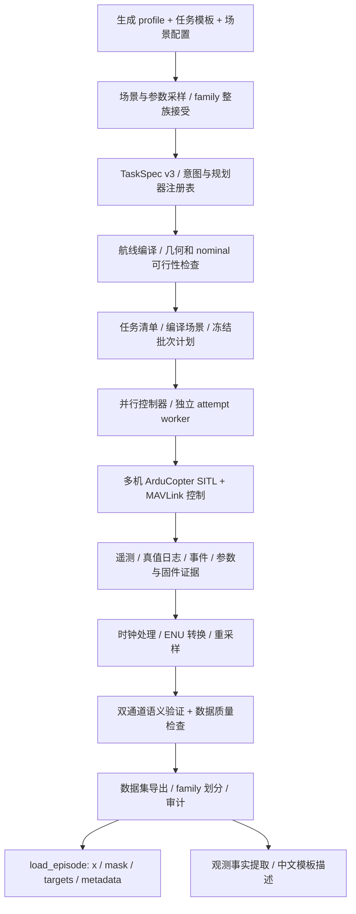

# 多无人机数据生成系统框架概览

> 本文状态更新于 2026-10-10，依据当前代码、A2 报告、pilot 暂停 B 复核及生产停止报告整理。本次文档核对基线为 `main=037ed7e`；生产运行基线为 `762a303`／`v0.6-pilot`，pilot30 运行基线为 `0dffcd8`／`v0.6-pauseA3`。事实层 v06b 已提交并离线验收。正式生产 r1 在 296/900 个任务后规则停止，未导出，保留为证据；台账持久化修复后另建 r2 批次 `v06_production900r2_seed2026100812`（标签 `v0.6-production-r2`），r2 准备中，见 §16.3。

## 1. 这个系统解决什么问题

系统面向多无人机态势感知研究，构建具有明确任务语义、可追溯执行证据和质量标记的多机轨迹数据。它把场景和任务配置编译成可执行航线，交给 ArduCopter SITL 中的真实飞控程序执行，再从飞控遥测与仿真真值中提取时序数据、任务完成标签及中文描述。

它的主要产品是 **episode 数据集**。一个 episode 对应一次多机任务运行，包含各无人机的位置、速度、有效性掩码、任务与场景信息，以及独立计算的语义和质量结果。合格且双通道语义一致的 episode 还可以得到结构化观测事实和模板化自然语言描述。

这里有三个不同层面的“生成”：

1. **任务生成**：采样场景、共用参数和飞法，形成任务清单及编译后的规划；这个步骤不启动 SITL。
2. **轨迹生成**：实际启动多机 SITL，让飞控执行任务，记录真实运行结果。规划通过仍可能运行失败。
3. **数据产品生成**：离线分析运行证据，导出 episode、质量与语义标签，再生成事实和描述。

这套系统已经形成从配置到可加载数据的完整工程链路。目前没有在这条链路内实现轨迹编码器训练、轨迹到语言模型的桥接训练或态势识别模型评测；这些是数据的下游用途。

## 2. 总体架构与设计思路



这个架构有五个主要设计原则：

| 原则 | 具体做法 | 解决的问题 |
|---|---|---|
| 配置、规划和执行分开 | JSON 描述任务；编译器产生航线；runner 执行航线 | 能在不启动仿真的情况下检查任务，也能保留规划与实际行为的差异 |
| 意图与飞法分开 | 意图定义判定目标，规划器定义完成目标的路径 | 同一意图可有多种飞法，不能用规划器名称代替任务完成证据 |
| 观测和真值分开 | FCU 遥测作为合作式观测；SITL 真值用于校验 | 下游输入不必依赖仿真真值，同时能够审计观测误差与标签可信度 |
| 结果与质量分开 | 任务成功、数据质量、语义一致、benchmark 资格分别记录 | 避免把“飞完了”“任务成功了”“数据可用”混成一个布尔值 |
| 版本和来源绑定 | 配置、固件、参数、分析文件、清单用版本和 SHA256 关联 | 防止数据重分析或代码变化后，旧结果被误认为新协议结果 |

这些层之间主要通过文件和清单交接，而不是依赖一个长期存活的内存对象。这使离线重分析、故障保留、人工暂停续跑和数据迁移更容易实现。

## 3. 需要先分清的概念

| 概念 | 在系统中的含义 |
|---|---|
| `scenario` | 物理场景：局部坐标原点、世界边界、目标区域、限制区域、无人机初始位置及平台信息等 |
| `TaskSpec` | 任务说明。v3 包含 `scenario`、`mission`、`planner`、`execution`，再加 family 与组件版本信息 |
| `mission.intent` | 被布置的任务意图，如侦察、巡逻、快速通过；这是任务来源标签，不是模型识别出的心理意图 |
| `flight_pattern` | 选定飞法，如等宽条带往返扫描、矩形螺旋扫描；它属于规划侧信息 |
| semantic phase | 接近、观察、巡逻、穿越、返回等有语义的执行阶段，用于执行和离线窗口划分 |
| `family` | 具有同一物理场景身份的一组任务。当前三意图生成配置让一个接受的 family 对应三个任务 |
| `profile` | 批量生成规则，规定种子、数量、采样范围、任务模板及可行性要求 |
| task / mission entry | 生产清单中的一个计划任务；还没有必要发生实际飞行 |
| `attempt` | 对一个任务的一次执行尝试，具有单独目录、预算记录和结果 |
| `run` | runner 实际产生的一次多机运行及原始证据，通过 `run_id` 识别 |
| analysis | 从某次 run 产生的一个版本化离线分析结果；同一个 run 可以有不同版本的分析 |
| `episode` | 导出到数据集中的一个运行样本；可能合格，也可能明确标记为失败或不合格 |

**几个版本号不能互相替代。** `TaskSpec.schema_version=3` 表示任务结构；`protocol_version=v0.6` 表示数据协议；分析 schema、语义验证器和质量策略还有各自版本。包内历史 `__version__` 也不能单独代表全部数据已经升级到 v0.6。

## 4. 主要目录和文件如何分工

以下路径相对于 `Simulation-dev/Multi-UAV SimpleGC/`。

| 目录或入口 | 主要职责 | 阅读时应注意 |
|---|---|---|
| `main.py` | 当前公共入口，最终委托 `swarm.py` 的命令行处理 | 文件前部还保留早期遥测辅助函数；当前主调用链在文件末尾 |
| `swarm.py` | 提供 `plan`、`generate`、`run`、`analyze`、`dataset`、`describe`、`inspect-dataset` 等子命令 | 通用命令入口与 v0.6 正式并行编排入口是两条不同入口 |
| `swarm_sim/` | 核心库：任务编译、生成、规划、执行、记录、分析、导出、描述和加载 | 存在旧版本实现和新版适配层，需要沿实际分派函数阅读 |
| `generation_profiles/` | 批量任务生成配置 | pilot 为 10 family、30 任务；production 为 300 family、900 任务 |
| `missions/v3/` | v3 意图任务模板，包括 v0.6 的三种任务模板 | 模板是任务规则，不是已经飞出的轨迹 |
| `tasks/`、`scenarios/` | 较早任务与场景配置及兼容输入 | 并非全部都使用当前三意图协议 |
| `quality_policies/` | 数据质量与资格计算所需的版本化策略 | 策略版本和哈希随数据保存，不能只看策略文件名 |
| `scripts/` | 批处理、验证、诊断、报告和历史阶段工具 | `run_parallel_batch.py` 是通用并行控制入口；`run_v06_pilot.py` 处理 pilot 专用流程 |
| `tests/` | 编译、规划、数据契约、快速通过、执行门禁、暂停续跑、兼容性等自动化检查 | 假 worker 和合成轨迹测试不能替代真实 SITL 验证 |
| `verification/` | 仓库内的验证摘要、清单、哈希和部分冻结输入 | 大型原始运行证据主要在仓库外，不保证每份完整轨迹都在此处 |
| `docs/` | 数据契约、接口说明、阶段计划、验证报告和运行命令 | 计划、历史文档、已执行报告必须区分；部分旧说明已过时 |
| `examples/` | 小规模示例 episode，供接口阅读和兼容性检查 | 保留 4 个 v0.5 示例，不是完整冻结数据集 |
| `ArducopterSITL/` | SITL 程序及相关仿真输入 | 执行前还需固件和参数基线验证 |
| `generated/`、`runs/`、`tmp_*`、`audit_*` | 历史生成结果、运行结果或诊断工作产物 | 目录存在不代表它就是当前正式数据源，优先依据批次清单和报告 |
| `replay_viewer/` | 回放与可视化相关工具 | 属于查看证据的辅助工具，不负责生成语义标签 |

`swarm_sim/` 内部可以再按六组理解：

| 组成部分 | 主要文件 |
|---|---|
| 任务与生成 | `tasks.py`、`mission_v3.py`、`generation.py`、`generation_v2.py`、`families.py` |
| 意图与规划 | `registry.py`、`reconnaissance.py`、`patrol.py`、`rapid_passage.py`、`flight_patterns_v06.py`、`route_planning.py` |
| 实际执行 | `runner.py`、`runner_v3.py`、`processes.py`、`vehicle.py`、`recording.py`、`run_provenance.py` |
| 批次控制 | `parallel_batch.py`、`parallel_worker.py`，加 `scripts/run_mission_list.py` |
| 离线分析与导出 | `analysis.py`、`analysis_v3.py`、`observation_processing.py`、`observations.py`、`truth.py`、`route_windows.py`、`mission_evaluation_v3.py`、`quality.py`、`dataset.py`、`dataset_audit.py` |
| 面向下游的数据接口 | `episode_loader.py`、`observer_facts_v0.py`、`language_templates_v0.py`、`language_v0.py` |

## 5. 第一层：如何产生可比较的任务

### 5.1 profile 决定采样空间

当前 `tri_intent_v06_pilot.json` 主种子为 `2026100811`，生成 10 个接受的 family；正式生产配置主种子为 `2026100812`，目标为 300 个 family。每个 family 带有侦察、巡逻和快速通过各一个任务。

当前 profile 包含的随机因素有：无人机数量 2/3/4、目标区域尺寸与位置、进入方向、进入距离、横向偏移、初始横队间距与旋转角、速度 2.0/2.5/3.0 m/s，以及是否要求返回。巡逻圈数和快速通过区外端点余量则是相应意图的专用参数。

随机性采用有身份的子流。场景与共用参数使用共用抽样逻辑；飞法选择使用含主种子、base、candidate、intent、variant 的独立子流。这样改变飞法选择逻辑时，可以核对同一候选的场景与共用参数是否保持一致。

### 5.2 family 是物理场景身份

`families.py` 将物理场景规范化并计算 SHA256，以此形成 `scene_content_v1` family 身份。纳入的是场景原点、世界、区域、限制区域，以及无人机物理初始状态等。

意图、规划器、执行模式、随机种子和任务名称等不进入这个物理身份。车辆的规范化排序与数值规范化也避免了单纯名称或表示顺序变化造成新的物理 family。

这意味着在同一场景上布置不同意图，可以有同一个 `family_id`。速度和返回要求虽然不是物理 family 哈希的全部定义，但生成器会在三个意图之间共用相应抽样结果。

这一设计支持配对比较，也为防止数据泄漏提供依据：同一物理场景的三种任务应该落在同一个数据划分中。

### 5.3 当前是“先抽飞法，再整族接受”

当前 v0.6 的接受流程为：

1. 抽一个候选场景和共用参数。
2. 独立抽定三个意图各自的飞法。
3. 编译这三个已经选定的任务，检查规划是否可行。
4. 只有三个都通过，才把整个 family 及三个任务放入最终清单。
5. 任意一个失败，就记录该候选全部尝试及原因，并整族拒绝，进入下一个候选。

不会在一个候选失败后临时换飞法把它救回来，也不会单独发布其中两个通过的任务。当前每个 base 的候选预算为 20。

这使最终生产清单没有规划拒绝的条目，并保留跨意图的完整配对关系。但整族筛选会改变接受后的分布：候选级侦察飞法等概率抽样，不保证接受后两种飞法数量各半；候选共用参数一致，也不代表最终接受集合不受可行性筛选影响。

生成输出包括 profile 快照、`generation_manifest.json`、`mission_list.json`、任务文件、编译场景和候选记录。拒绝原因是诊断证据，不应该混入最终待执行清单。

## 6. 第二层：意图、飞法与编译器

### 6.1 注册表的职责

`registry.py` 定义三个核心契约：

- `IntentSpec`：规定任务参数、目标条件、语义阶段、服务阶段、允许规划器、通道评估函数及审计指标。
- `PlannerSpec`：规定规划器名称和版本、规划参数规范化，以及 `plan_routes()`。
- `PlanResult`：携带各机各阶段航线、任务分配和规划诊断。

当前注册由代码显式初始化，并不是在目录中自动扫描任意插件。新增一种飞法需要通过契约、编译、数据协议、验证和准入流程；写一个生成路径的函数并不等于已经生产启用。

### 6.2 当前生产登记的意图与飞法

| 意图 | 当前飞法 | 路径设计 | 实际语义检查侧重点 |
|---|---|---|---|
| 侦察 `reconnaissance` | `equal_strip_lawnmower` | 目标矩形等宽分区，每机在自己的条带内往返扫描 | 共享区域覆盖证据及要求的返回条件 |
| 侦察 `reconnaissance` | `equal_strip_rectangular_spiral` | 与上一飞法使用相同等宽分区，条带内改为矩形螺旋向内扫描 | 沿用侦察验证器，不用飞法名字直接判定覆盖成功 |
| 巡逻 `patrol` | `staggered_same_loop` | 多机沿同一环路同向运动，以错开的起点组织巡逻 | 边界走廊访问和重访证据，不只看配置中要求了几圈 |
| 快速通过 `rapid_passage` | `line_abreast` | 横向间隔组织的直穿路径，端点在目标区外 | 进入、对侧离开、直行、无驻留和无绕圈等实际几何条件 |

`interleaved_lanes`、`bidirectional_lanes` 和 `column` 已不在 v0.6 生产飞法清单中。斜队 `echelon` 仅保留显式离线候选能力；A2 准入集通过 102/300，即 34%，未达到至少 270/300 的 90% 要求，因此没有生产登记。

“未登记”不等于源码完全没有相关函数；调用候选规划能力与默认生产允许使用是不同层次。

### 6.3 编译过程

`compile_task()` 根据任务 schema 分派。对 v3，`compile_mission_v3()` 先规范化任务，再取得意图和规划器，产生 `PlanResult` 并校验阶段、车辆与路径，随后编译为 runner 可执行的场景。

当前连续语义航线模式为 `semantic_phase_route_v1`。一个语义阶段中的多个航点可以连续执行，阶段间仍有协调边界。代码还保留 `waypoint_barrier_v1` 等旧模式，所以“采用连续航线”不能理解为整次任务完全没有阶段同步。

规划侧检查的是路径和 nominal 时空关系，包括世界边界、时长及多机间距。nominal 路线由理想路径与速度参数构成，不能保证飞控闭环执行后逐时刻完全一致。A2 报告中 900/900 规划通过，指的是这个阶段，不是 900 次仿真已经成功。

### 6.4 当前执行参数的两个关键点

v0.6 有独立的 `final_hold_s=2.0`：最后一个任务端点到达后保留最终悬停，再记录任务结束。要求返回时，最后端点在返回阶段；未要求返回时，在最后任务阶段。它与到达确认驻留及飞控航点自身的 hold 参数不是同一个概念。

当前 `firmware_version_timeout_s=10.0`。早期 A2 的 2 秒等待优化已撤回；最新 pilot 使用恢复后的 10 秒版本。不能继续以“节省约 8 秒”描述当前行为，也不能把这个等待称为已经实现的显式“参数表准备就绪”事件门禁。

## 7. 第三层：如何执行真实的多机仿真

`runner.run_scene()` 识别任务版本，v3 进入 `runner_v3.run_scene_v3()`。一次 run 的主要生命周期为：

1. 检查任务与编译场景的绑定，创建唯一 run 目录，写入配置与元数据。
2. 验证固件二进制和参数模板是否符合已保存基线。
3. `SITLProcesses` 为每个无人机启动独立 ArduCopter 实例，使用独立工作目录与端口。
4. `Vehicle` 通过 MAVLink 连接，开始接收遥测并记录原始消息。
5. 读取固件版本和参数，保存请求、回读及比较证据；发现不一致时起飞前拒绝。
6. 等待飞行准备条件，完成解锁和起飞。
7. 上传阶段任务，确认各机 AUTO 状态，执行连续航线并完成阶段协调。
8. 完成最终悬停，记录任务窗口终点，然后降落和清理进程。
9. 将完成、失败或中断状态及错误写入元数据。

飞行控制使用多机并行操作，但某些阶段转换需要所有机满足条件。发生异常时，系统仍尽量保存已经产生的原始消息、事件、参数与状态，便于之后判断是规划问题、控制问题、采集问题还是基础设施问题。

主要执行组件如下：

| 组件 | 职责 |
|---|---|
| `processes.py` | 启动和检查 SITL 进程，分配每机端口，隔离运行目录，保存 stdout 并清理进程 |
| `vehicle.py` | MAVLink 收发、状态检查、任务上传与确认、模式切换、起降及到达控制 |
| `recording.py` | 记录遥测和采样信息，保留原始证据，为后续轨迹处理提供输入 |
| `run_provenance.py` | 验证固件、模板与飞控回读参数，保存版本和来源证据 |
| `runner_v3.py` | 把上述能力组织成一个有超时、阶段事件和失败保存的任务执行生命周期 |

这里不是直接把理想航线当成输出轨迹。任务参考航点、FCU 输出轨迹和 SITL 真值分别保留，后续分析可以量化它们的差异。

## 8. 第四层：并行批次、冻结与暂停续跑

### 8.1 并行单位是任务，不是无人机

`parallel_batch.py` 的控制器管理多个 shard，每个 shard 同一时刻执行一个 attempt。一个 attempt 内部又包含 2–4 个无人机实例。

所以 \(K=2\) 表示两个多机任务并行，可能同时有 4–8 个 SITL 实例。它不是“只运行两架无人机”。同一 family 的任务在 prepare 时分配到同一个 shard；family 数据划分也同时被冻结。

### 8.2 prepare 做什么

prepare 不启动仿真。它生成并验证任务清单，检查所有发布任务都规划通过，冻结任务、场景、生成证据、执行代码与相关输入的哈希，写出任务顺序、shard、端口、预算和用途标记。

它还检查端口和磁盘余量。pilot 两个端口块为 19100–19199 和 19200–19299；每机的基本端口按 10 的步长分配，实际使用还包含 TCP/UDP 的相应偏移。端口探测只说明检查时可用，不是操作系统层面的长期端口预留。

磁盘检查结合每次尝试的估算存储量、剩余尝试预算和导出预留。它是容量护栏，不是固定保证每个 episode 产生完全相同大小的文件。

### 8.3 run 与 worker 的关系

控制器是批次状态的单一写入者：先预留 attempt，再派给空闲 shard；worker 执行一次任务、分析并返回结果，控制器验证证据后登记。锁和原子状态写入降低多进程更新冲突。

`parallel_worker.execute_attempt()` 通过 `run_mission_list()` 运行已经冻结的一个任务，再显式调用 v3 分析器，使用当前批次指定的路线进度、巡逻验证及验收策略版本。它不会让旧 runner 自行自动重启同一个已经有证据的 attempt。

任务序号、尝试序号、完成顺序和结果文件都被记录。attempt 总预算与任务数是不同计数；明确可重试的起飞前问题与在飞失败也不是同一种处理。

### 8.4 人工暂停和规则停止不同

- **人工 Ctrl+C**：停止继续派发，让正在执行的任务收尾，然后保存暂停状态。用户可以显式 `--resume`，恢复未完成任务；已登记任务不重新派发，预算和滚动窗口延续。
- **规则停止**：命中安全、完整性、质量滚动检查等停止条件，记录停止原因；控制器拒绝把它当成人工暂停随意续跑。

批次护栏包括真实间距证据、完整性检查、family 划分泄漏、描述一致性以及滚动异常监测等。规则执行和 hard failure 分类以当前控制器、worker 和所选验收策略为准；不能仅由一个错误字符串推断所有运行故障都会即时停批。

### 8.5 finalize 的顺序

finalize 要求批次已完成、没有规则停止且尚未 finalize，然后依次：

1. 复核冻结输入和证据完整性。
2. 合并运行结果，检查任务不重不漏。
3. 显式绑定每个 run 对应的分析目录与清单哈希。
4. 导出 dataset，检查导出顺序及冻结的 family split。
5. 审计数据集与生成清单、attempt 账本的对应关系。
6. 生成事实和描述，检查完整性、哈希绑定与一致性。
7. 对全部 episode 调用加载器，并检查公共场景角点。
8. 写 `final_report.json`，将 `control.json` 的 `finalized` 置为 true。

完成不能只看“终端已经退出”：要结合 `control.json` 的 `completed=true`、`finalized=true`、无停止原因，以及 `final_report.json` 和数据/语言清单检查结果。

## 9. 第五层：从原始消息到时序观测

### 9.1 两个独立数据通道

**observation 通道**来自 FCU 遥测，主要使用 `GLOBAL_POSITION_INT` 的位置与速度，属于已知身份的合作式飞控观测。

**truth 通道**来自 SITL 的仿真日志，是验证位置、几何关系和任务语义的参考。它不应直接进入公开轨迹特征或被包装成传感器观测。

系统目前不是相机、雷达或射频测量模拟器，也没有解决未知身份的多目标关联。下游输入包含已知 agent ID 的多机状态序列，这决定了研究结论的适用范围。

### 9.2 坐标与速度统一

经纬度和高度转换到场景原点下的 ENU 坐标，即 East、North、Up。每机每帧保留六维特征：

\[
\mathbf{x}_{t,i}=(e,n,u,v_e,v_n,v_u).
\]

MAVLink 速度字段是 North/East/Down 方向的厘米每秒，进入 ENU 特征时对应 \(v_e=vy/100\)、\(v_n=vx/100\)、\(v_u=-vz/100\)。单位和轴向转换是数据契约的一部分，不能凭字段顺序直接拼接。

### 9.3 时间处理和有效性

系统保留宿主机单调时钟、消息接收时刻和飞控启动时间等证据，利用被动 `SYSTEM_TIME` 消息构建时钟映射并做留出检查。处理包含严格时间顺序检查、精确重复包处理，以及间隙与异常样本审计。

被动时钟拟合残差能衡量映射的一致性，但无法直接证明绝对同步精度或识别全部传输延迟。最新 pilot 的时钟等级全部为 `acceptable`，不能改称 `strict`。

当前典型输出采用 10 Hz 网格。只有符合间隙规则的区间才可插值；无效区间要留下掩码与审计信息，不能跨越长缺口平滑补成“看起来完整”的轨迹。

分析同时保留完整生命周期证据和任务观测窗口。起飞、阶段事件、任务结束及降落记录帮助解释运行，最终送给模型的任务观测窗口不等于全部生命周期日志。

## 10. 第六层：如何产生语义标签与质量标记

### 10.1 语义不是复制任务名称

`mission_evaluation_v3.py` 对 observation 与 truth 分别提取阶段服务窗口、执行意图验证，再比较两边结果。服务窗口尽量依据实际到达和阶段证据限定，而不是只用规划的 nominal 到达时间；部分到达证据不足时会进入相应回退或未知处理。

例如快速通过不能只因为任务名叫 `rapid_passage` 就被标为成功。需要实际轨迹支持进入目标区、从对侧离开、直行程度、区内低速驻留和无绕圈等条件；返回阶段应独立处理，不能把返回路线混进主穿越阶段制造折返。

当前快速通过几何版本的阈值包括：边界余量 2 m、最大横向偏离 3 m、低速定义 0.5 m/s、最长低速持续 1 s、最大折返 2 m、路径/弦长比 1.1。这些是当前协议的规则阈值，有离线交叉否定与 pilot 余量证据，不能理解为所有环境下的普适定义。

侦察以共享区域覆盖为目标；巡逻关注边界访问与重访。规划器提供参考和任务分配，验证器主要核对实际通道证据。

### 10.2 三值条件与通道一致性

条件允许 `true`、`false`、`null/unknown`。缺少足够证据时使用未知，避免把“无法判断”强行变成失败或成功。

`mission_success` 和 `mission_success_observation` 分别表达真值侧与观测侧任务结果；`semantic_consistency` 记录 `agree`、`disagree` 或 `unknown`。一致性还核对内部条件冲突，不只比较两个最终布尔值。

返回要求是附加任务条件。意图验证器不能擅自把公共返回条件覆盖掉。未验证的 split/merge/formation-change 等行为也应保留未评估状态，而不是自动产生肯定标签。

### 10.3 数据质量与任务成功的区别

| 字段/结果 | 回答的问题 |
|---|---|
| run status | runner 是否正常完成执行生命周期？ |
| `mission_success` | 真值证据是否支持任务目标完成？ |
| `mission_success_observation` | 观测证据是否支持任务目标完成？ |
| `semantic_consistency` | 两个通道的语义判定是否一致且有足够证据？ |
| `episode_quality_eligible` | 数据记录、时钟、真值、间距、执行约束等是否满足数据质量要求？ |
| `benchmark_eligible` | 是否满足更严格的既有 benchmark 使用条件，包括任务成功和观测侧语义要求？ |
| `strict_benchmark_eligible` | 是否进一步满足 strict 等级要求？ |

当前 v3 的 `episode_quality_eligible` 故意不直接依赖任务成功：任务未达成但记录完整、证据可靠的样本，在设计上仍可能具有数据价值。`benchmark_eligible` 则另有成功和一致性要求。

这些标记只是本系统的使用资格规则，不代表已经完成统计意义上的独立泛化评测。

## 11. 第七层：分析产物、导出与审计

`analyze_run_v3()` 在一个新的分析目录中保存结果，生成 source 与 artifact 哈希。不同版本重分析应产生新目录，并显式选择结果；覆盖旧结果或只依赖一个模糊的“latest”指针，会破坏来源可追溯性。

常见分析文件如下：

| 文件 | 内容 |
|---|---|
| `observations.csv` | 时序 FCU 观测，含有效性、时间依据及六维 ENU 特征 |
| `truth.csv`、`truth_source.csv` | 对齐后的真值及真值来源样本 |
| `estimation_error.csv` | 观测与真值的估计误差 |
| `reference_waypoints.csv` | 参考航点和阶段信息，用于诊断 |
| `task.json`、`mission.json`、`shared_scene.json` | 任务和共享场景来源 |
| `allocation.json`、`semantic_plan.json` | 规划分配及语义执行计划 |
| `labels.json`、`semantic_validation.json` | 最终标签及双通道条件证据 |
| `quality.json`、`execution_constraints.json` | 质量、无效区间、间距及执行约束结果 |
| `phase_windows.json`、`execution_metrics.json` | 实际阶段窗口与执行诊断 |
| `clock_models.json`、`truth_provenance.json` | 时钟模型和真值来源 |
| `onboard_mission_param_check.json` | 板载任务参数检查 |
| `manifest.json` | 该分析的协议、版本、来源哈希、文件哈希和资格摘要 |

`dataset.build_dataset()` 从选定的分析结果导出 `episodes/` 和 `dataset_manifest.json`。它检查源分析绑定、协议和策略一致性，默认拒绝混用不相容的数据协议；混合控制模式也需要显式允许。

**导出保留失败和不合格运行。** 清单通过资格字段说明可用性，后续训练代码负责按用途筛选。这样能够核对生成任务是否缺失，也保留失败原因，避免只保留成功运行造成无说明的选择偏差。

数据集按 `family_id` 与固定 salt 哈希进行 train/validation/test 划分，当前规则为 70%/15%/15%。这是哈希阈值规则，不保证每个小批次严格达到这些数量比例；同一 family 的所有意图样本保持同一 split。

`dataset_audit.py` 进一步比对 episode、生成清单、attempt 账本、指标与 family split，帮助发现任务遗漏、重复或划分泄漏。`swarm.py` 中的 `inspect-dataset` 用于这一数据集审计；名为 `audit` 的另一个旧子命令仍是历史轨迹 JSON 审计，不应混淆。

## 12. 第八层：事实与中文描述是怎样产生的

描述链路是：`describe_dataset()` → `extract_observer_facts()` → `generate_descriptions()` → 描述一致性校验。

当前采用确定性事实提取和中文模板渲染，没有调用语言模型自由生成文本。每个合格且 `semantic_consistency=agree` 的 episode 产生四份描述：三个使用 train 模板分区，一个使用 test 模板分区。每句话保存 `template_id` 和 `fact_ids`，便于追溯其证据。

这里有两种独立划分：`episode_split` 指 family 层面数据划分；`template_partition` 指措辞模板划分。一个 episode 可以有四种措辞，但这不表示四份文本是四次独立轨迹运行，也不应该把 test episode 的 train 措辞误认为训练可用样本。

`observer_facts_v0.py` 从通道轨迹及相关窗口提取可观察事实。例如是否呈平行条带、环绕或直穿运动，以及可观察的返回行为。**计划飞法与观测运动模式分开：** 规划指定矩形螺旋，并不意味着事实提取器已经能够可靠识别“矩形螺旋”。

当前观测模式词表是 `parallel_strips`、`perimeter_loop`、`direct_passage` 和 `unclear`。`unclear` 表示已有证据但运动模式未明确；`null` 表示相应事实缺失或不可判，两者不能合并解释。

### 已提交并通过离线验收的事实层 v06b 修复

已提交 pilot 使用 `observer_facts_v06`，其中矩形螺旋为 `unclear` 5/5；往返扫描为 `parallel_strips` 3/5、`null` 2/5。

当前代码已改为 `observer_facts_v06b` / `pattern_detector_v06b`，修复在 `a345f27` 提交，注册表、任务模板和语言模块的事实版本也已同步。新的几何降级检查对主阶段轨迹按至少 2 m 的间隔保留点，计算有符号累计转角；原本被判为平行条带的轨迹若累计转角绝对值达到 230°，改为 `unclear`。

这个检查不读取计划飞法或意图来强行命名运动模式。它用于减少持续同向转弯的环路/螺旋被误称为平行往返，同时避免旧横向折返判据造成通道分歧和槽位置空。暂停 B 的生产函数路径离线验收为 12/12：v0.5 原有 125/125 合格侦察槽位不变，pilot30 往返扫描修复为 5/5 `parallel_strips`，矩形螺旋保持 5/5 `unclear`，巡逻 9/9、快速通过 10/10 原有槽位不变。结果另存 `SwarmData/v06_pattern_acceptance_20261008/acceptance.json`，旧 pilot 事实与描述文件未覆盖，详见 pilot 报告的“复核结论”。本文更新时未重新执行验收。

语言结果保存在独立目录，由 `language_manifest.json` 绑定数据集清单、事实与描述文件的哈希。数据集变化后不能无检查地沿用旧语言产物。

## 13. 第九层：下游如何加载数据

`episode_loader.load_episode()` 是模型侧的统一接口，返回：

| 返回字段 | 含义 |
|---|---|
| `x` | 形状为 \(T\times N\times 6\) 的嵌套列表，按时间和 agent 排列六维位置/速度 |
| `mask` | 形状为 \(T\times N\) 的有效性掩码 |
| `t_s` | 有序时间网格 |
| `agent_ids` | 当前加载的 agent 顺序 |
| `targets` | 标签字典，供监督或评估使用，应与模型输入分开 |
| `metadata` | 协议、组件版本、split、资格标记、特征列、无效区间等 |

加载器会验证受支持协议及相关哈希绑定，检查重复样本、时间顺序和非有限值。缺失/无效行填六个零，同时置 `mask=false`；零值只有结合掩码才能正确理解。

返回值不是现成的 PyTorch tensor，也没有自动归一化，元数据明确标记 `normalized=false`。训练代码还需要做 tensor 转换、窗口切分、归一化与按资格筛选。

`load_public_scene()` 只公开目标区域四个 ENU 角点，避免将完整任务规划或真值作为公共场景输入。虽然 `load_episode()` 同时返回 `targets`，这并不允许把目标标签、计划飞法和特权诊断直接拼入轨迹输入。

v0.5 episode 继续使用同一加载接口。v0.6 新增元数据在旧数据上按缺省处理，如 `protocol_version=None`、`flight_pattern=None`、`component_versions={}`，不会为兼容而改变六维特征含义。A2 已包含仓库内 4 个示例 episode 的兼容回归；本文没有重新执行该回归。

## 14. 把一个 family 从头走到尾

以一个接受的三机 family 为例，系统先抽出目标矩形、三机初始位置、共同速度和返回要求，再分别选择侦察、巡逻和快速通过的飞法。

三个规划全部通过后，发布三个任务。它们的物理场景与共用参数配对一致，任务意图、航线和意图专用参数不同；它们具有同一 family 身份并属于同一数据 split。

执行时这三个任务是三次多机运行，不是在一次飞行中同时完成三个互斥意图。每次运行记录三机遥测和真值，离线分析分别产出六维观测、双通道语义与质量结果，最终导出三个 episode。

如果其中一个运行中途断开 TCP，规划仍可保持“通过”，但该 run 的执行状态与质量会记录失败，语义可能未知。导出仍保留这个 episode；描述层跳过不满足门槛的样本。不会把另两个成功兄弟样本的结果复制给它。

## 15. 关键调用关系和命令入口

| 操作 | 主调用关系 | 是否启动仿真 |
|---|---|---|
| 编译单个任务 | `main.py` → `swarm.main()` → `compile_task()` → `compile_mission_v3()` → planner → route compiler | 否 |
| 批量生成任务 | `swarm.main()` → `generation.generate()` → `generate_v2()` → sampler / family gate → `compile_task()` | 否 |
| 执行单场景 | `swarm.main()` → `runner.run_scene()` → `run_scene_v3()` → SITL / Vehicle / Recorder | 是 |
| 准备并行批次 | `scripts/run_parallel_batch.py prepare` → `parallel_batch.prepare()` | 否 |
| 并行执行 | `scripts/run_parallel_batch.py run` → `Controller` → worker → `execute_attempt()` → `run_mission_list()` → runner / analyzer | 是 |
| 离线分析 | `swarm.main()` → `analysis.analyze_run()` → v3 analyzer；worker 使用显式版本参数 | 否 |
| 导出数据集 | `swarm.main()` → `dataset.build_dataset()`；并行 finalize 也调用此函数 | 否 |
| 数据集审计 | `inspect-dataset` → `dataset_audit.audit_dataset()` | 否 |
| 生成事实与描述 | `describe` → `language_v0.describe_dataset()` → facts → templates | 否 |
| 加载 episode | 下游 Python → `load_episode()` / `load_public_scene()` | 否 |
| 并行统一收尾 | `finalize` → merge → dataset → audit → language gate → loader → final report | 否 |

`swarm.py batch` 是旧的同场景串行重复入口，不能代替当前具有冻结计划、全局 attempt 预算、shard 与续跑语义的并行控制器。

直接使用通用分析命令时，也不能假设其所有默认参数自动等于正式批次版本；当前并行 worker 显式指定路线进度、巡逻验证和验收策略，这些选择随证据保存。

## 16. 当前已经做到哪里

### 16.1 已提交的离线规划证据

A2 正式配置尝试 782 个候选 family，接受 300 个，拒绝 482 个。最终发布 900 个任务，全部规划通过，生产清单中规划拒绝为 0/900。

| 意图/飞法 | 候选规划通过/候选数 | 最终清单规划通过/任务数 |
|---|---:|---:|
| 侦察往返扫描 | 340/386 | 146/146 |
| 侦察矩形螺旋 | 367/396 | 154/154 |
| 巡逻同环错起点 | 522/782 | 300/300 |
| 快速通过横队 | 401/782 | 300/300 |

候选中自身通过但兄弟任务失败的规划也会整族舍弃，因此“候选通过数”不能直接当成“最终可执行清单数量”。A2 离线测试记录为 279/279 通过，并包含 DR130 回归、快速通过交叉否定及 v0.5 示例兼容检查。

### 16.2 已提交的真实 pilot 证据

最新成功收尾的 pilot 为 `v06_pilot30b_seed2026100811`，运行代码为 `v0.6-pauseA3` 对应 `0dffcd876722b30150c2cd5e246781df65b3e9dc`。后续事实修复提交为 `a345f27`，生产运行标签为 `v0.6-pilot=762a303`，本次文档核对 HEAD 为生产停止报告提交 `037ed7e`；不能把当前 HEAD 与各批次运行 SHA 混为一谈。

| 意图/飞法 | 运行数 | 质量合格 | 双通道语义一致 |
|---|---:|---:|---:|
| 侦察往返扫描 | 5 | 5/5 | 5/5 |
| 侦察矩形螺旋 | 5 | 5/5 | 5/5 |
| 巡逻同环错起点 | 10 | 9/10 | 9/10 |
| 快速通过横队 | 10 | 10/10 | 10/10 |
| 合计 | 30 | 29/30 | 29/30 |

30 个任务都有终态记录和导出条目，其中 1 个巡逻运行因 SITL TCP 中断失败，并未重跑或补飞。因而“30/30 任务登记完成”不等于“30/30 成功飞完”。

该批次时钟不可用为 0/30，全部为 acceptable；strict 为 0/30。数据集保留 30 个 episode，其中 29 个 benchmark eligible；描述为 29 个 episode 共 116 条，跳过 1 个。审计无 issues、无 family split 泄漏，划分为 train 21 / validation 6 / test 3。

真实人工暂停续跑也已验证：发送过一次 Ctrl+C，正在执行的任务收尾后暂停，再 resume 完成剩余任务；报告核对任务不重不漏、预算及滚动窗口连续。实际暂停时点与最初约 15/30 的目标不同，完整时间线以 pilot 报告为准。

快速通过真实双通道判定为 20/20 通过；侦察/巡逻交叉否定中没有被误判为快速通过的正例。矩形螺旋覆盖任务通过与其观测模式仍为 unclear 是两个不同结论。

### 16.3 正式生产已运行但规则停止

正式生产为 `v06_production900_seed2026100812`，主种子 `2026100812`，计划 300 family／900 任务，K=2，尝试预算 990；运行使用 `762a303a0482725fc794eef093f023549e3f2712`／`v0.6-pilot`。两段执行期间完成一次人工暂停续跑，最终 296 个不同任务有终态记录，重试 0，604 个计划任务未运行。

| 项目 | 截至规则停止的结果 |
|---|---|
| run 状态 | completed 288、failed 8，总计 296 |
| 质量资格 | 合格 287/296，不合格 9/296 |
| 双通道语义 | 一致 289/296、未知 7/296、不一致 0/296 |
| 时钟不可用 | 1/296 |
| family 三意图均已运行 | 98/300；三意图全部质量合格 89/300 |
| 控制器状态 | `completed=false`、`finalized=false`、`paused=false`，有规则停止原因 |
| 正式数据产品 | 无数据/语言清单，无 `final_report.json` |

停止发生于 2026-10-10 05:22:08（America/Los_Angeles）：`control.json.tmp` 替换 `control.json` 收到 `PermissionError: WinError 5`，控制器记为台账持久化规则停止。报告指出现有替换无重试，读者共享方式存在瞬态占用风险；具体占用进程未被直接捕获，不能把候选进程当成确定责任者。r2 修复已实现：`save_atomic` 对 WinError 5/32 做指数退避重试（首次 0.05 s、上限 1 s、累计约 8 s），重试用尽仍按原格式规则停止；worker 改读控制器在预留落盘后写入的 `attempts/<id>/assignment.json`，不再打开 `control.json`，原有身份、端口、目录和重复执行核对保留；控制器每次保存台账后另写只读展示用 `progress.json`，其写入失败只记日志、不影响批次。离线测试见 `tests/test_parallel_persistence.py`；尚未经过实跑。

296 次运行的逐尝试证据保留在仓库外批次中，报告完成相应诊断；这些记录不是 296 个已经导出的正式 episode，更不代表 900 任务数据集。规则停止不可直接 `--resume`，不得清除原因、补飞、覆盖准备或强行 finalize。用户复核后已决定以同 profile、同主种子另建 r2 批次从头运行 900 个任务，r1 保持原状。

### 16.4 尚不能声称完成的部分

现有证据支持三意图生成、四种生产飞法、900 任务离线规划、pilot 的执行和收尾，以及生产的 296 次运行与停止诊断。它不支持宣称正式 900 任务完成、生产数据集可用于训练或已打 `v0.6-production` 标签，也不能把正式计划全部内容当作实现结果。

事实层 v06b 已验证并用于生产运行代码；旧 pilot 质量、事实与描述仍绑定原版本。持久化容错已在 r2 修复中实现但未实跑；正式计划 P3 扩展仍是待办。

## 17. 开发代码、冻结归档和大型数据分别在哪里

| 位置 | 保存内容 | 使用方式 |
|---|---|---|
| `F:/CASIA/Drone Swarm Situational Awareness Algorithm/Simulation-dev/` | 当前开发代码、模板、策略、测试、文档、验证摘要及少量示例 | 当前修改和理解架构的主要仓库 |
| `F:/CASIA/Drone Swarm Situational Awareness Algorithm/Simulation/` | v0.5 冻结归档代码、完整阶段数据及相关证据 | 作为历史基线与回归来源，不能当作当前 v0.6 开发目录 |
| `F:/CASIA/Drone Swarm Situational Awareness Algorithm/SwarmData/` | 仓库外批次、规划证据、原始运行、导出集与语言结果 | 存放大型数据，利用清单/哈希与代码版本关联 |

v0.5 冻结数据的既有统计为 260 个 episode、252 个质量合格、1008 条描述；开发仓库保留 4 个示例 B001/B002/B037/B098，不等于把全部冻结数据迁入开发仓库。

已完成的 pilot30 目录为：

```text
F:/CASIA/Drone Swarm Situational Awareness Algorithm/SwarmData/
└── parallel_batch/
    └── v06_pilot30b_seed2026100811/
        ├── control.json
        ├── final_report.json
        ├── merged_records.json
        ├── analysis_selections.json
        ├── audit_attempt_ledger.json
        ├── dataset_audit.json
        ├── dataset/          # 30 个 episode 及数据集清单
        ├── language/         # 29 个 episode 的事实、116 条描述及语言清单
        └── 其他冻结输入与 shard/attempt 执行证据
```

正式生产停止证据位于 `SwarmData/parallel_batch/v06_production900_seed2026100812/`：保留 `control.json`、`stop_report.json`、冻结计划及 296 次 shard/attempt 证据，没有正式导出的 dataset 或 language 清单。暂停/停止副本和诊断位于 `SwarmData/agent_work/v06_production/`，精确定位见生产停止报告 §16。

旧 pilot 和停止批次均保留；目录名与用途标记决定身份，不能混成训练集。pilot30 明确标记 `purpose=pilot`、`training_data=false`。

## 18. 已知边界与文档差异

| 项目 | 当前应采用的解释 | 依据 |
|---|---|---|
| 旧进度快照与计划基线 | `9812645` 是计划起始基线；本次核对 HEAD 为 `037ed7e`，生产运行标签为 `762a303`；根 README/CLAUDE 已同步停止状态 | Git、台账与生产停止报告 |
| 部分旧接口文档只描述双意图或只登记侦察 | 当前生产登记为三意图、四种飞法，旧文档应按历史接口理解 | `registry.py`、三意图 profile |
| 旧说明称连续航线待后续实现 | 当前 runner 与 compiler 已支持 `semantic_phase_route_v1`，并经 pilot 使用 | `mission_v3.py`、`route_planning.py`、`runner_v3.py`、pilot 报告 |
| 正式计划或 A2 提及固件等待 2 秒 | 当前模板和 pilot 为 10 秒，优化已经撤回 | 当前 v06 模板、`run_provenance.py`、pilot 报告 |
| 计划飞法等于观测运动模式 | 两者独立；矩形螺旋目前没有专门的可靠观测模式标签 | 注册表词表、事实提取器、pilot 报告 |
| 旧 pilot 的事实版本与当前代码 | 旧 pilot 保持 v06；当前 v06b 已提交并通过另存的离线验收，不静默改写旧结果 | `a345f27`、事实提取器、pilot 暂停 B 复核 |
| 正式生产原准备状态与实际运行 | 已由准备推进到 296/900 规则停止；无正式导出集，停在暂停 C | `control.json`、生产停止报告 |
| 规划安全等于实际安全 | nominal 检查、实际真值检查和观测检查是不同证据层 | 规划诊断、`quality.py`、执行/验收策略 |
| 数据生成已包含复杂现实感知环境 | 当前输入是合作式 FCU 遥测，场景仍主要围绕矩形区域和既有平台/参数 | 观测契约、模板和当前 profile |

尚未由这条链路提供的能力包括真实相机/雷达/射频测量建模、未知身份关联、复杂环境及对抗性任务覆盖、通用运动模式识别，以及模型训练和泛化评测。仅有 family 划分也不能替代近重复审计、OOD 数据设计或下游实验方案。

如果后续扩展系统，主要扩展点已经存在：生成 profile 扩大采样空间；注册表引入新意图或飞法；通道验证器增加证据规则；数据契约和加载器增加经过版本化的公开特征；事实与模板层增加经过验证的可观察描述。任何扩展仍需要区分离线规划、真实运行和数据协议三个层面的验证。

## 19. 建议的代码阅读顺序与依据链接

可以按“入口 → 任务编译 → 生成 → 执行 → 分析 → 导出 → 描述/加载”的顺序阅读，下面链接对应本文的主要依据。

| 阅读目标 | 代码或报告 |
|---|---|
| 主入口与命令分派 | [main.py](<F:/CASIA/Drone Swarm Situational Awareness Algorithm/Simulation-dev/Multi-UAV SimpleGC/main.py:184>)、[swarm.py](<F:/CASIA/Drone Swarm Situational Awareness Algorithm/Simulation-dev/Multi-UAV SimpleGC/swarm.py:12>) |
| 任务版本分派与 v3 编译 | [tasks.py](<F:/CASIA/Drone Swarm Situational Awareness Algorithm/Simulation-dev/Multi-UAV SimpleGC/swarm_sim/tasks.py:29>)、[mission_v3.py](<F:/CASIA/Drone Swarm Situational Awareness Algorithm/Simulation-dev/Multi-UAV SimpleGC/swarm_sim/mission_v3.py:234>) |
| 意图与飞法契约 | [registry.py](<F:/CASIA/Drone Swarm Situational Awareness Algorithm/Simulation-dev/Multi-UAV SimpleGC/swarm_sim/registry.py>) |
| family 身份与整族生成 | [families.py](<F:/CASIA/Drone Swarm Situational Awareness Algorithm/Simulation-dev/Multi-UAV SimpleGC/swarm_sim/families.py:39>)、[generation_v2.py](<F:/CASIA/Drone Swarm Situational Awareness Algorithm/Simulation-dev/Multi-UAV SimpleGC/swarm_sim/generation_v2.py:220>) |
| 多机执行生命周期 | [runner_v3.py](<F:/CASIA/Drone Swarm Situational Awareness Algorithm/Simulation-dev/Multi-UAV SimpleGC/swarm_sim/runner_v3.py:184>) |
| 批次冻结、控制与统一收尾 | [parallel_batch.py](<F:/CASIA/Drone Swarm Situational Awareness Algorithm/Simulation-dev/Multi-UAV SimpleGC/swarm_sim/parallel_batch.py:178>)、[parallel_worker.py](<F:/CASIA/Drone Swarm Situational Awareness Algorithm/Simulation-dev/Multi-UAV SimpleGC/swarm_sim/parallel_worker.py:231>) |
| 离线分析与资格规则 | [analysis_v3.py](<F:/CASIA/Drone Swarm Situational Awareness Algorithm/Simulation-dev/Multi-UAV SimpleGC/swarm_sim/analysis_v3.py:54>)、[quality.py](<F:/CASIA/Drone Swarm Situational Awareness Algorithm/Simulation-dev/Multi-UAV SimpleGC/swarm_sim/quality.py:91>) |
| 数据导出与加载 | [dataset.py](<F:/CASIA/Drone Swarm Situational Awareness Algorithm/Simulation-dev/Multi-UAV SimpleGC/swarm_sim/dataset.py:20>)、[episode_loader.py](<F:/CASIA/Drone Swarm Situational Awareness Algorithm/Simulation-dev/Multi-UAV SimpleGC/swarm_sim/episode_loader.py:45>) |
| 事实和描述 | [observer_facts_v0.py](<F:/CASIA/Drone Swarm Situational Awareness Algorithm/Simulation-dev/Multi-UAV SimpleGC/swarm_sim/observer_facts_v0.py>)、[language_v0.py](<F:/CASIA/Drone Swarm Situational Awareness Algorithm/Simulation-dev/Multi-UAV SimpleGC/swarm_sim/language_v0.py:47>)、[language_templates_v0.py](<F:/CASIA/Drone Swarm Situational Awareness Algorithm/Simulation-dev/Multi-UAV SimpleGC/swarm_sim/language_templates_v0.py:486>) |
| A2 离线验证和生产规划统计 | [v0.6_pauseA2_report.md](<F:/CASIA/Drone Swarm Situational Awareness Algorithm/Simulation-dev/Multi-UAV SimpleGC/docs/v0.6_pauseA2_report.md>) |
| 最新真实 pilot 结果与限制 | [v0.6_pilot_report.md](<F:/CASIA/Drone Swarm Situational Awareness Algorithm/Simulation-dev/Multi-UAV SimpleGC/docs/v0.6_pilot_report.md>) |
| 正式生产 296 次运行与规则停止 | [v0.6_production_stop_01.md](<F:/CASIA/Drone Swarm Situational Awareness Algorithm/Simulation-dev/Multi-UAV SimpleGC/docs/v0.6_production_stop_01.md>) |
| 运行流程与标志文件 | [v0.6_formal_run_commands.md](<F:/CASIA/Drone Swarm Situational Awareness Algorithm/Simulation-dev/Multi-UAV SimpleGC/docs/v0.6_formal_run_commands.md>) |
| 原始正式计划，需结合调整及报告阅读 | [v06_formal_plan.md](<F:/CASIA/Drone Swarm Situational Awareness Algorithm/Simulation-dev/Multi-UAV SimpleGC/docs/v06_formal_plan.md>) |

本文是架构说明，不改变上述协议、任务、停止规则或正式计划的执行状态。
