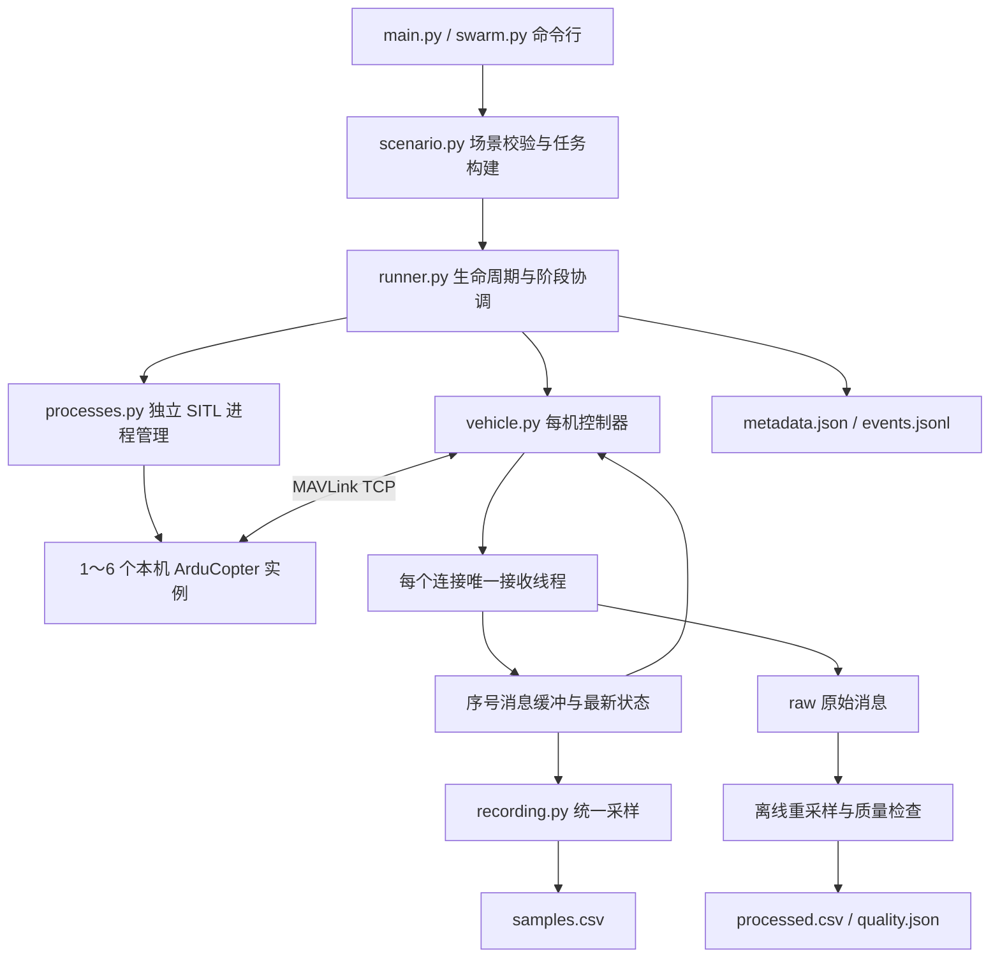

# Multi-UAV SimpleGC 改进方案、可执行能力与下一步计划

日期：2026-09-25  
版本：0.1.0  
工程：`Multi-UAV SimpleGC`。原始 `SimpleGC` 目录未参与本次代码修改。

## 1. 本次实现的目标

本次将复制后的单机航点程序扩展为一个可运行的本机多无人机场景框架，覆盖“独立启动 → 起飞准备 → 分阶段并行飞行 → 状态记录 → 自动降落 → 进程回收 → 数据检查”的完整流程。

第一版限定 1～6 架飞机、正常实时速度、短距离局部场景。采用 ArduCopter 自身的 AUTO 航点控制，通过共同的阶段释放时间协调各架飞机。运行过程中不需要外部服务器，也不要求提前手动启动 SITL。

本版解决的是多机运行与数据采集的工程基础。严格的逐点时序跟踪、共享物理碰撞、闭环编队和高层意图识别仍属于后续工作。

## 2. 修改后的架构



各层职责如下：

| 模块 | 实际职责 |
|---|---|
| `swarm_sim/scenario.py` | 校验身份、数值、初始间距、完整阶段目标；建立公共坐标系并生成变速和驻留航点 |
| `swarm_sim/processes.py` | 检查端口，建立独立实例目录与参数，隐藏启动窗口，管理本次启动的进程 |
| `swarm_sim/vehicle.py` | 每条连接唯一接收线程，心跳、状态检查、ACK 判断、任务上传、起飞、模式切换、航段执行和降落 |
| `swarm_sim/runner.py` | 管理并行控制、准备屏障、阶段屏障、全局超时、失败处理、输出隔离和清理 |
| `swarm_sim/recording.py` | 增量采样、坐标换算、缺失标记、原始消息重采样和距离检查 |
| `swarm_sim/audit.py` | 只读检查旧 JSON 轨迹，不默认将时间索引视为秒，不自动执行旧轨迹 |
| `scripts/summarize_verification.py` | 汇总保留的实际运行记录，生成 `verification_summary.json` |

Python 环境通过项目 `.conda-env` 指定为 `llm`，项目级 `AGENTS.md/CLAUDE.md` 记录环境调用规则。本次没有安装依赖，也没有安装全局 Hook。

## 3. 已实现的控制与协调机制

### 3.1 每架飞机对应独立实例

每架飞机都有独立的 agent ID、MAVLink system ID、实例编号、TCP 端口、初始位置、参数文件、EEPROM 和日志目录。

默认端口为 19100、19110、19120 等。每次场景使用全新目录启动，并传入 `--wipe`；不复用旧 `swarm/` 目录的飞行状态。程序只通过所持有的进程句柄结束自己的实例，不按程序名称批量杀进程。

附带二进制的版本字符串为 `ArduCopter V4.0.4-dev (de791682)`。实测发现，显式设置 `--base-port` 时，不能依赖该构建的 `--instance` 帮助文本自动完成预期端口偏移，因此实现显式分配每架实例的端口。

### 3.2 一个连接只有一个消息接收者

控制等待器和记录器不直接争抢 socket 消息。接收线程把消息写入原始日志，并发布到带序号的消息缓冲与最新状态缓存。

控制操作按消息序号等待新回复，检查命令 ACK 和任务 ACK。任务上传允许重复请求同一个任务项，使用已发送序号集合判断完成，避免把重传次数当成已完成项数。

对 TCP EOF/断开采用明确异常，避免当前 pymavlink 默认行为反复打印 EOF 并忙等。

### 3.3 起飞准备与阶段屏障

准备阶段等待有效 GPS、EKF 状态和新鲜位置数据，确认解锁，再发送起飞指令。高度和垂直速度持续满足条件后，进入 LOITER 并报告准备完成。

所有飞机准备完成后，才上传第一阶段任务；每个阶段均完成任务准备后，管理器给出共同释放时刻，各机并行切换 AUTO。所有飞机完成该阶段后，再进入下一阶段。完成所有航段后，统一进入 LAND 并等待解除解锁。

同步只保证共同阶段调度。各机的加速、转弯、到达和驻留完成仍有实际时间偏差，日志保留这些偏差；没有宣称物理仿真锁步或逐点精确同步。

### 3.4 速度与等待

每阶段每架飞机的任务包含 home 占位项、`MAV_CMD_DO_CHANGE_SPEED` 和目标航点。航点的等待参数落实 `hold_s`，不只是保留在输入 JSON 中。

当前每阶段每架飞机配置一个目标位置，可通过多个阶段组成路线。目标速度限制为 0.5～15 m/s，高度限制为 3～100 m。这些输入范围用于第一版约束，不代表已完成所有范围内的飞行性能验证。

## 4. 数据记录与质量检查

### 4.1 保存内容

| 文件 | 说明 |
|---|---|
| `scenario.json` | 本次实际采用的归一化场景配置 |
| `metadata.json` | 状态、错误、版本、源代码与固件 SHA256、进程/端口、时间锚点、阶段命令发送偏差和清理结果 |
| `events.jsonl` | 实际阶段事件与本机相对时间 |
| `raw/<agent>.jsonl` | 每条原始 MAVLink 消息和接收时间，消息自身的源时间字段被保留 |
| `samples.csv` | 从准备到降落的统一主机时间采样，包含 ENU 位置/速度、姿态、消息年龄和有效位 |
| `processed.csv` | 第一航段释放到最后航段完成的统一时间位置/速度数据 |
| `quality.json` | 有效覆盖率、缺失数量、最近距离、风险标记与基础可用性判断 |
| `sitl/<agent>/` | 本次实例参数、飞行日志、控制台日志和状态文件 |

输出目录包含 UTC 时间与随机后缀，多次运行不会覆盖旧数据。原始消息和实时采样每秒刷新文件缓冲，不再等待完整任务结束才保存。进程被突然强制结束时，最后一小段未刷新数据仍可能丢失；这不是每条消息的持久化落盘保证。

### 4.2 时间与坐标约定

最终实现使用 `time.perf_counter()` 这一高分辨率单调计时器。多机接收和记录共享本机时间基准，原始消息还保留 `time_boot_ms` 等字段，但没有实现飞控源时钟偏移估计或 TIMESYNC。

所有飞机共用一个地理原点与海拔基准。位置采用局部 WGS84 线性换算，速度从 MAVLink 的北、东、下约定转换为东、北、上。输出高度依据 MSL 高度减去公共原点海拔，不直接拼接各机相对 home 的高度。

当前场景限制在原点东/北各 ±2000 m，坐标算法面向局部实验；后续若扩大范围或提高精度，应升级为 ECEF/ENU 严格转换，并明确椭球高与海拔高的关系。

重采样输出对应 \(T \times N \times 6\) 的位置/速度数据，其中特征为 \([x_E,y_N,z_U,v_E,v_N,v_U]\)，实际文件采用长表 CSV，并包含 `valid` 掩码。姿态保留在 raw 和 samples 中，当前没有对四元数进行离线同步插值。

### 4.3 可用性门槛

仅当运行完整结束、每架飞机飞行窗口内的有效位置覆盖率至少 99%、且没有发现低于 `min_separation_m` 的接近风险时，`quality.usable` 才为 true。

长于 `max_gap_s` 的区间不插值，范围之外不外推。距离检查同时考虑相邻有效采样之间的分段线性相对运动，降低交叉发生在采样点之间时的漏检风险；缺失区间无法判定。检查针对处理后的飞行窗口，不是完整物理碰撞仿真，也不包含在线轨迹修改。

质量门槛只是基础工程检查，不代表意图标签正确、跟踪误差达标或满足科研 benchmark 的全部要求。

## 5. 当前可执行能力

| 能力 | 当前状态 |
|---|---|
| 1、2、6 架飞机的本机独立实例 | 已提供示例并进行真实 SITL 验证 |
| 同时起飞准备、共同释放航段 | 已实现；完成时间允许不同 |
| 多航段飞行、目标速度与驻留 | 已实现并在短航线验证 |
| 公共时间记录、ENU 位置与速度导出 | 已实现 |
| 原始遥测、元数据、质量报告 | 已实现 |
| 自动降落、运行结束回收实例 | 已实现 |
| 全局超时、任务/命令超时、断连识别 | 已实现 |
| 每次运行重新初始化、隔离输出 | 已实现 |
| 顺序重复批处理 | 已实现 `batch --repeat`；没有断点续跑和自动失败重试 |
| 旧轨迹只读检查 | 已实现 `audit`；没有自动重定时或转换导入 |
| 旧单机入口 | 保留 `flyControl.py`；不具备新多机入口的全部保障 |

`main.py` 现为多机 CLI，原先无参数运行自动执行全部旧任务的行为已改变。新入口不接受任意外部飞控连接，控制对象为本次管理器启动的本机 SITL 实例。

## 6. 验证结果

验证环境为本机 Windows、Conda `llm`、Python 3.12.3、pymavlink 2.4.50。测试没有修改固件，也没有关闭飞控解锁检查来强行通过。

### 6.1 单元与回归测试

已通过 34 项测试，包含原有 18 项回归测试及新增测试。重点验证：重复身份和危险路径拒绝、目标遗漏及非有限数值拒绝、初始间距、坐标与高度基准、变速与等待参数、长间隔插值拒绝、采样之间交叉距离、速度轴变换、ACK 新旧区分、上传重传、TCP EOF、取消等待及失败记录不覆盖。

同时修正旧 `send_mission_start()` 把起始任务序号误放到 confirmation 字段的问题，并增加回归测试；旧就绪检查也不再将缺失 GPS 消息视为通过。新多机链路使用独立实现。

### 6.2 真实 SITL 运行

已保留以下可核对的运行结果：

| 运行目录标识 | 结果 | 说明 |
|---|---|---|
| `single_smoke_20260925T090441Z_5b7c669b` | 通过 | 单机两航段、驻留、降落，217 个处理后采样时刻，无位置缺帧 |
| `parallel_two_20260925T090700Z_7f32910d` | 通过 | 双机两航段与降落完整完成；属于早期计时实现验证 |
| `timeout_check_20260925T091007Z_bed8783b` | 预期失败并通过检查 | 人为设置 10 秒全局超时，错误记录正确且实例已回收 |
| `parallel_six_20260925T091232Z_aa13b8f5` | 通过 | 最终端口配置及断连处理下，六机完整运行约 94.9 秒；218 个采样时刻、每机覆盖率 100%、最小间距约 11.446 m |
| `parallel_six_20260925T091606Z_b185f83f` | 通过 | 连续批处理第 1 轮，约 94.9 秒，217 个采样时刻，每机覆盖率 100% |
| `parallel_six_20260925T091742Z_1f15ee22` | 通过 | 连续批处理第 2 轮，约 94.6 秒，217 个采样时刻，每机覆盖率 100% |

所有运行的完整状态与后续连续批处理结果见 `verification_summary.json`。可以用 `python scripts/summarize_verification.py` 从保留的运行日志重新生成汇总。

测试过程中也保留了两次六机失败记录：一次在同时执行另一超时实验期间，有单个旧版 SITL 进程在降落阶段退出，控制台未给出明确原因，不能认定其根因已经查明；另一次是核实旧固件端口偏移行为时的端口冲突，已通过显式端口配置修正。失败数据不会因已有飞行数据而被标记可用。

连续两轮六机批处理的初始配置相同、运行目录独立，全部正常降落并回收进程。三次成功六机实验的最小间距约 11.45 m，均高于示例设定的 5 m 阈值。连续两轮的阶段启动日志最大分散约 0.25/0.28 ms，而阶段完成事件最大分散约 110/138 ms，说明共同调度并不消除实际飞行差异。

`phase_start_sent` 日志记录在控制任务调用切换 AUTO 之前，因此其偏差是主机控制任务释放指标，不是 socket 实际发送时间差，更不等于飞机同时动作。阶段完成偏差反映包含驻留在内的完成事件，也不是精确的进入航点半径时差。首次单/双机结果使用较低分辨率单调时钟，不能将其显示的零偏差解释为完全同步。

## 7. 运行示例

在本工程目录的 PowerShell 7 中执行：

```powershell
conda run -n llm --no-capture-output python main.py validate scenarios/demo_2uav.json
conda run -n llm --no-capture-output python main.py run scenarios/demo_2uav.json
conda run -n llm --no-capture-output python main.py run scenarios/demo_6uav.json
conda run -n llm --no-capture-output python main.py batch scenarios/demo_2uav.json --repeat 2
```

检查旧轨迹：

```powershell
conda run -n llm --no-capture-output python main.py audit loadData/uav_trajectories_persistent_20260213_164652.json
```

默认旧数据有 24 个 agent 和 1949 个点。相邻点距离除以输入时间增量的中位数约为 93.59，最大值约为 2223.35；在没有确认时间单位之前，工具将其标为“米/输入时间单位”，不将其直接作为 m/s。旧数据不满足直接按本版短场景执行的前提，需要单独转换和审查。

## 8. 已知限制

1. 只验证了理想参数下的短距离航线，不能外推为任意长时间或复杂队形均稳定。
2. 旧二进制存在版本与参数兼容性问题；日志仍提示原参数模板中的 `MAG_ENABLE`、`CH7_OPT` 不被识别，不能假定这些参数已生效。
3. 阶段屏障不会在航段内部保持固定队形，也不会强制所有飞机同一时刻到达。
4. 没有源时钟同步、倍速协调或多进程物理锁步。
5. 没有碰撞动力学、气流耦合、在线避碰、雷达或视觉传感器建模。
6. 没有在线意图识别、语义自动验证或训练/测试数据集划分。
7. 没有为旧轨迹自动规划满足速度和加速度约束的新时间表。
8. 相同场景能够使用相同初始配置重跑，但没有保证逐采样点的确定性复现。
9. 本版批处理在同一进程内顺序执行；多组场景同时运行和更大规模尚未作为验收能力。

## 9. 下一步改进计划

| 优先级 | 工作 | 建议验收标准 |
|---|---|---|
| P0 | 固定可追溯的稳定飞控版本与匹配参数；定位旧版进程偶发退出 | 连续多轮六机运行成功，无未知参数警告，固件和参数可复建 |
| P0 | 记录实际生效参数、飞控版本消息及更完整的进程诊断 | 仅靠运行目录可还原环境、参数和失败阶段 |
| P0 | 增加源时钟偏移/漂移估计、启动与采样延迟指标 | 对齐误差有测量方法和阈值，不能只看 CSV 时间相同 |
| P1 | 建立旧轨迹转换器，明确时间单位并处理跳点和等待 | 输入轨迹通过速度、加速度、爬升与转弯约束检查 |
| P1 | 扩展为带时间参考轨迹跟踪，按需求引入 GUIDED 目标流 | 同时给出位置误差、事件时间误差和失联行为验证 |
| P1 | 加入增量失败恢复、断点续跑和可配置重试策略 | 中断后不覆盖已有成功结果，失败原因完整可追溯 |
| P1 | 加入独立真值通道、数据质量和语义事件校验 | 区分规划轨迹、飞控估计和仿真真值；标签对应实际执行 |
| P2 | 对 12/24 机、倍速、风噪声随机化开展基准测试 | 给出 CPU/内存、有效采样率、失败率与同步误差曲线 |
| P2 | 根据研究需要加入闭环编队、在线避碰或态势算法 | 为每种新增能力设计独立的可观测验收场景 |

建议下一轮先固定飞控与数据时钟，再导入真实业务轨迹。当前版本已经提供可复用的多机执行与记录基础，后续实验应在其质量报告和运行日志之上逐项扩展。
