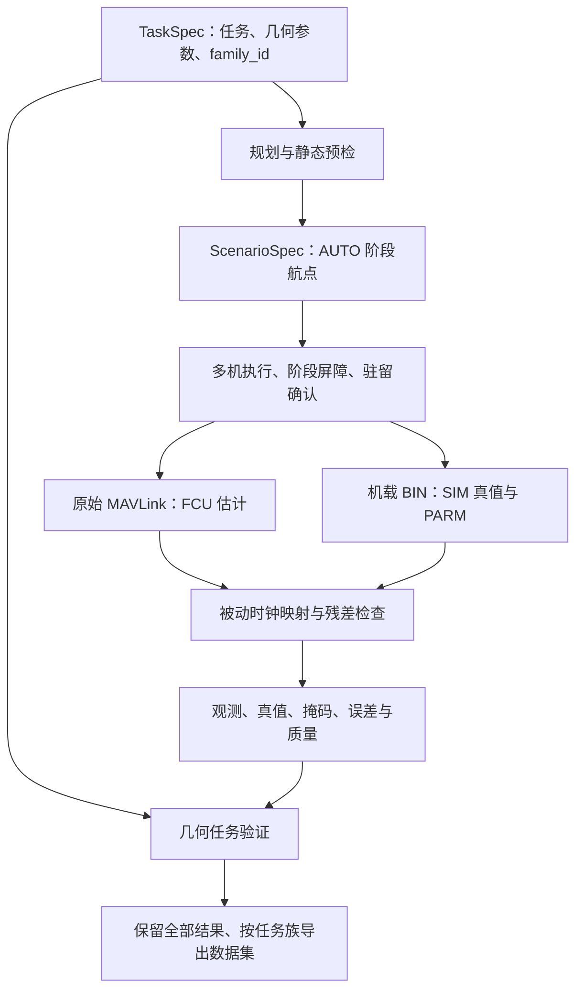

# Multi-UAV SimpleGC 第二轮迭代：任务、真值、验证与数据集

版本：0.2.0。日期：2026-09-25。运行环境：本机 Windows，Conda `llm`，Python 3.12.3，pymavlink 2.4.50。本轮未安装依赖，未修改相邻的原始 `SimpleGC` 工程。

## 1. 本轮实际做了什么

框架从“多机分阶段航点执行器”扩展为一条小规模任务数据生成流程：任务定义 → 几何规划与预检 → 本机 SITL 执行 → 真值与观测导出 → 几何任务验证 → 按任务族组织数据集。

继续复用原来的 1～6 机 AUTO 执行后端。没有把高频 GUIDED、复杂意图标签、随机风场和大规模扩机混入本轮。新增内容是可执行代码与运行产物，而不是仅增加设计文档。

| 层次 | 文件 | 职责 |
|---|---|---|
| 任务与规划 | `swarm_sim/tasks.py`、`tasks/*.json` | 三类几何任务、任务族标识、生成航点、名义路径间距和时间下界预检 |
| 执行 | `runner.py`、`vehicle.py`、`processes.py` | 独立本机 SITL、阶段屏障、飞控任务、任务目标驻留确认、退出回收 |
| 记录 | `recording.py`、`raw/`、机载 BIN | 主机接收时间、原始遥测、SIM 真值及参数证据 |
| 时钟与真值 | `truth.py` | 源时间到主机接收时间的被动映射、留出样本残差、机载 SIM/PARM 导出 |
| 离线分析 | `analysis.py` | 分析版本隔离、统一采样、缺失掩码、估计误差、双通道间距检查、来源哈希 |
| 任务验证 | `evaluation.py` | 点访问、驻留、巡逻顺序与圈数、理想几何覆盖率 |
| 数据集 | `dataset.py` | 校验来源、保留失败样本、按 family_id 划分并复制分析产物 |

上述模块路径均位于本工程中；前三个既有执行模块位于 `swarm_sim/`。



## 2. 三类任务的准确含义

所有任务几何参数以各机生成点为二维局部偏移，同一模板平移到每架飞机的责任区域；高度使用场景公共 ENU 原点。当前不是统一大区域的自动多机任务分配器。

| TaskSpec 类型 | 生成的行为 | 执行后判断 |
|---|---|---|
| `point_visit` | 飞到给定相对目标点并驻留 | 每架飞机进入三维容差球，并持续满足驻留时间 |
| `rectangle_patrol` | 按矩形四角有序巡逻，可指定圈数 | 验证每个阶段的实际到点与驻留，统计完成圈数 |
| `coverage_scan` | 各机沿自身矩形区域作往复扫描 | 计算有效轨迹覆盖的栅格中心比例，检查是否达到覆盖阈值 |

示例均为三机：`tasks/point_visit_3uav.json`、`tasks/patrol_3uav.json`、`tasks/coverage_3uav.json`。已生成对应的 `scenarios/task_*.json`，可以直接运行。

覆盖模型是“固定半径的理想水平圆盘”。只有高度处于指定容差内的有效位置参与覆盖计算；相邻有效采样间用线段近似，不跨缺失段连线。它没有相机视场、地形遮挡、目标检测概率或雷达量测，覆盖率不能解释为真实侦察成功率。

`TaskSpec` 必须显式给出 `task_id` 和 `family_id`。不支持的任务字段会报错，例如加入尚未实现的 `forbidden_regions` 不会被静默忽略。任务生成后若直接修改编译场景中的航点，运行时会拒绝不一致的 `task_spec`；应修改任务后重新生成场景。

## 3. 本轮发现并修复的执行问题

第一轮三机巡逻中，飞行进程完整结束，但部分阶段在 `phase_finished` 记录前，位置证据不足以证明驻留满 1 秒。验证器正确给出 `mission_success=false`。这说明协议层的航点完成与本框架的几何任务条件需要分别检查；目前没有把差异的全部原因归结为某个固件缺陷。

新执行逻辑在 AUTO 阶段结束、进入 LOITER 后，增加 `confirm_target()`：读取带接收时间的最新位置，在目标三维容差内重新累计连续的 FCU 源时间。离开容差、源时间回退或超过 0.5 秒的采样间断都会重置累计；位置过期不会用于确认。成功后记录 `task_target_verified`，失败有超时限制，场景总超时仍有效。

因此，任务模式会增加一次验证驻留，实际停留可能比飞控航点里的 `hold_s` 更长。验证器使用该确认事件扩展阶段证据窗口，仍然根据轨迹计算到点与驻留，不因有确认事件而直接宣判成功。无 `task_spec` 的旧航点场景保持原有执行流程。

## 4. 时钟：能测量什么，不能声称什么

保留每架飞机的仿射趋势模型：

\[
\hat t_{host,rel}=a_i t_{FCU}+b_i
\]

拟合输入是原始 `SYSTEM_TIME.time_boot_ms` 与主机接收时间。这里的主机相对时间以分析窗口起点为零，不是 UTC；无效的 `time_unix_usec=0` 不参与转换。

已有六机日志显示，单一线性模型不能完全跟上仿真运行速率的变化，部分 P95 接收残差超过 50 ms。因此实际重采样采用每秒中位数节点的分段线性映射，同时保留仿射趋势供审计。偶数序号样本用于拟合，奇数序号样本用于留出残差检查。源时间回退、时钟证据间隔超过 2 秒、局部速率明显异常均会导致不可用；禁止向拟合范围之外外推。

`rate_difference_ppm` 反映仿真源时间与主机时间的运行速率差，不能直接称为硬件晶振漂移。留出残差包含调度、传输与模型误差，只是可复查的诊断量。单向传输时延没有被识别，`absolute_alignment_bound_s` 明确为 `null`。本轮没有实现主动 TIMESYNC 往返校准或物理锁步。

源时钟不可用时，观测可以按接收时间导出，并在 `time_basis` 标明退化；不会伪造真值对齐或把该次结果纳入合格集。过短任务也可能因证据不足而无法通过时钟门槛。

## 5. 真值、观测与参考分开保存

`SIMSTATE` 遥测在当前旧固件中不包含完整高度和源时间，因此本轮选择机载 BIN 的 `SIM` 记录导出位置、姿态四元数与 `TimeUS`。它来自 SITL 仿真状态，与 FCU 的导航估计来源不同。每架机应对应一个新生成的 BIN；缺失或出现多个日志时，不自动拼接可能发生时间重置的数据。

| 文件 | 含义 |
|---|---|
| `reference_waypoints.csv` | 计划航点、顺序、速度与驻留；没有预定到达时刻 |
| `observations.csv` | 公共时间网格上的 FCU 估计 ENU 位置、速度、有效掩码、时间来源 |
| `truth_source.csv` | BIN SIM 原始源时间、ENU 位置、原生姿态四元数 |
| `truth.csv` | 对齐并重采样后的 SIM 真值位置与掩码 |
| `estimation_error.csv` | 可比较时刻的 FCU 位置与 SIM 位置之差 |
| `logged_parameters.json` | BIN PARM 每个参数最后一次记录的值 |

四元数保留 SITL 原生姿态约定，没有随着位置转换而重新旋转为 ENU 姿态。本轮未输出真值速度，也未用位置差分冒充真实速度。PARM 导出是日志证据，不保证等价于仿真结束瞬间的完整在线参数快照；本轮实跑每架读取到 1202 个参数，`SYSID_THISMAV` 与分配的机号一致。

位置对照量为：

\[
e_{est}(t)=\left\|p_{FCU}(t)-p_{SIM}(t)\right\|_2
\]

它包含 FCU 估计/滤波及记录时刻语义的影响。当前参考仍是事件驱动航点，不存在严格的 \(p_{ref}(t)\)，所以没有输出“时间参考轨迹跟踪误差”，也没有承诺同时到达或航段内维持队形。

观测契约明确为：已知身份的合作式飞控遥测。该观测与外部雷达/视觉跟踪数据的可得性、缺失模式和身份不确定性不同。

## 6. 标签、质量与样本纳入规则

标签分别保存 `assigned_intent`、`observed_behavior`、`mission_success`、`failure_reason`、`label_provenance`。点访问和巡逻使用 FCU 位置与三维容差、驻留规则；时钟有效时，驻留持续时间回到 FCU 源时间计算。离线驻留离散化容许量为一个名义采样周期，默认 0.1 秒。

`mission_success` 为 `true / false / null`。`null` 表示缺少足够证据，不是失败或成功。执行失败不会改写最初指定的任务，完整飞行也不会自动使任务成功。这里的任务标签是人为赋予的几何任务类型，不能证明隐含战术意图。

当前 `benchmark_eligible` 同时要求：

1. 运行完整结束；
2. 各机观测与对齐真值有效比例均至少 99%；
3. 各机时钟留出 P95 接收残差不超过 50 ms；
4. FCU 轨迹和 SIM 真值轨迹的分段线性间距检查均无风险且无未检查区间；
5. 几何任务成功。

50 ms 是本版工程筛选阈值，不是已经证明的同步误差上界。间距结论仍依赖被动时间对齐和采样间的线性近似，不能替代共享碰撞动力学或在线避碰。单机的机间间距检查为空集，不能据此推断其碰撞安全性。

无任务定义的历史运行可重新分析，但任务标签为空，不自动改造成有标签的合格样本。失败后的部分窗口可以导出，但会明确标记 `partial_window`。

## 7. 数据组织与防泄漏

每次运行结束会自动产生独立的 `analysis_v02_<时间>_<后缀>/`。重新执行 `analyze` 会新增分析目录，`analysis_latest.json` 指向最新版；原始日志、已有分析与历史执行结果保留。运行根目录的 `quality.json` 是运行时结果快照，离线重分析后的最新判据应以该指针所指目录为准。

每个分析目录还包含 `task.json`、`labels.json`、`quality.json`、`clock_models.json`、`truth_provenance.json`、`manifest.json`。manifest 保存原始证据、分析产物与分析源码的 SHA256。导出数据集前会核验，若分析后原始文件或标签被修改则拒绝导出。

数据集按 `family_id` 的稳定哈希划分，目标比例 70%/15%/15%。重复运行、失败重试、噪声变体、语言变体与未来滑窗必须继承同一个家族 ID，不能每个运行随机生成一个 family_id。框架目前不能自动识别两个不同 ID 是否实际源于同一模板。

导出保留全部输入样本，使用 `benchmark_eligible` 筛选合格子集。无 family_id 的旧失败运行保留但不分配 split。训练输入应仅使用 `observations.csv` 中的位置/速度及有效掩码；task、reference、truth、labels 和执行状态属于标签或辅助证据，不能混作观测特征。

CSV 是按时间和 agent_id 排列的长表，可还原为 \(T\times N\times6\) 位置/速度张量及掩码。当前没有直接生成 NPZ、滑动窗口或自然语言文本。本轮示例家族数量很少，稳定哈希可能全部分到 train；它是流程验证集，不是已经平衡好的科研训练/验证/测试集。

## 8. 运行方式

在本工程 PowerShell 7 中执行。所有计算、SITL 进程及文件写入均在本机完成，不依赖外部仿真服务器。

```powershell
# 直接运行已经编译好的任务场景
conda run -n llm --no-capture-output python main.py run scenarios/task_point_visit_3uav.json
conda run -n llm --no-capture-output python main.py run scenarios/task_patrol_3uav.json
conda run -n llm --no-capture-output python main.py run scenarios/task_coverage_3uav.json

# 修改 TaskSpec 后生成新的场景文件，输出文件必须不存在
conda run -n llm --no-capture-output python main.py plan tasks/patrol_3uav.json --output scenarios/my_patrol.json
conda run -n llm --no-capture-output python main.py validate scenarios/my_patrol.json

# 重新分析某次历史运行，不启动 SITL
conda run -n llm --no-capture-output python main.py analyze runs/patrol_three_20260925T095620Z_01757831

# 导出已分析的多个运行，输出目录必须不存在
conda run -n llm --no-capture-output python main.py dataset runs/patrol_three_20260925T095145Z_5a3915d1 runs/patrol_three_20260925T095620Z_01757831 --output datasets/my_patrol_dataset

# 回归测试与本轮运行汇总
conda run -n llm --no-capture-output python -m unittest discover -s tests -v
conda run -n llm --no-capture-output python scripts/summarize_v02.py
```

`run/batch` 返回 0 表示满足对应门槛，1 表示执行失败或数据/任务门槛未通过。`plan/validate/analyze/dataset` 返回 0 表示该操作成功；例如成功分析一个失败运行仍返回 0，应读取导出的质量报告。输入错误通常返回 2。

## 9. 验证记录

本轮测试与实跑的机器可读结果见 `verification_v02.json`，所有运行目录均保留。测试覆盖原有功能、三类任务编译、非法约束拒绝、任务与航点绑定、路径相交、时间不足、已知时钟映射、变速时钟、时间重置/缺口、驻留间断、覆盖缺口、未知证据、失败样本保留、同族划分和产物完整性校验。

**回归测试：50 项全部通过。** 本轮进行了 6 次三机真实 SITL 运行，包含发现问题后的针对性复跑。最终执行逻辑下的代表结果如下；耗时包含准备、飞行与降落，最小间距列使用 FCU 轨迹。

| 任务 | 运行目录 | 耗时 | 帧数 | 最小间距 | 任务与数据门槛 |
|---|---|---:|---:|---:|---|
| 三机点访问 | `point_visit_three_20260925T100252Z_328cb383` | 74.74 s | 89 | 11.460 m | 通过，三机均完成访问与驻留 |
| 三机矩形巡逻 | `patrol_three_20260925T095620Z_01757831` | 108.53 s | 391 | 15.491 m | 通过，三机均完成一圈 |
| 三机覆盖扫描 | `coverage_three_20260925T100409Z_7f2e5b46` | 117.85 s | 496 | 15.465 m | 通过，各机覆盖 47/48 个栅格中心，即 97.92%，阈值为 90% |

这三次代表运行中，各机观测有效率及对齐真值有效率均为 100%，FCU 与 SIM 两种轨迹的间距检查均通过。各任务取最差飞机的时钟留出 P95 接收残差，分别为 37.10、25.70、31.32 ms。各机 FCU-SIM 位置 RMS 差异范围分别为 0.212～0.218、0.158～0.159、0.147～0.148 m。这些数值只描述当前短距离、理想参数场景；不同任务的轨迹与统计窗口不同，不能据此直接比较算法优劣。

首次巡逻 `patrol_three_20260925T095145Z_5a3915d1` 完整飞行，但驻留语义不合格，仍保留。最终数据集位于 `datasets/v02_final_verification/`：包含本轮全部 6 次三机尝试和一条历史超时记录，共 7 条；5 条满足本版门槛，1 条为驻留语义不合格，1 条为执行超时。两次巡逻共享 family_id，确认没有跨 split。当前三个示例家族恰好均被哈希分到 train，尚不能用作独立测试集。

已核对各机记录的 1202 个 PARM 参数，其中系统编号分别为 1、2、3。所有实跑均完成本次进程回收，最后检查 `arducopter` 残留进程数为 0。收尾由管理器主动终止后台 SITL，`cleanup` 中的进程退出码应结合 `status`、降落事件与异常记录解读，不能单独等同于飞行失败。

此外，对已有六机成功日志重新导出了 SIM 真值并完成时钟审计。本轮没有重新声称完成六机任务类型的全套实跑；三类任务的新执行验证以以上三机结果为准。

## 10. 下一步建议

| 优先级 | 工作 | 验收条件 |
|---|---|---|
| P1 | 固化固件、参数和测试矩阵；补更多家族与重复实验 | 多个几何布局、速度、机数下记录通过率及失败原因；保留失败分布 |
| P1 | 多任务清单、断点续跑和显式重试记录 | 中断后续跑；每次 attempt 有独立 ID；重试不改变 family_id 或抹去失败 |
| P1 | 真值侧任务复核及标签一致性分析 | 对比 FCU 与 SIM 的任务判断，明确估计误差导致的标签歧义 |
| P1 | 正式数据加载器与按家族先划分再切窗 | 输出张量/掩码、固定特征契约；检查窗口与派生样本跨集合泄漏 |
| P2 | 主动时钟往返测量、更明确的事件时间语义 | 量化 RTT、偏移估计与异常率；区分控制释放、响应、实际状态变化 |
| P2 | 时间参数化参考与可选 GUIDED 流式后端 | 明确时间约束、位置/速度误差、超时与失流处理；与 AUTO 做同任务对照 |
| P2 | 理想观测与外部观测模型分层 | 再引入测量噪声、丢测、身份不确定性，真值和任务标签仍可追溯 |
| P3 | 风/传感器参数随机化、规模扩展、复杂高层任务 | 先有稳定基线与明确失败归因，再扩展任务含义和仿真规模 |

当前没有实现禁飞区路径搜索、动力学可行性证明、续航/电池约束、共享碰撞、相互气流、在线避碰、相机渲染、复杂战术意图识别或 LLM 语言生成。静态预检只给出必要几何条件与理想速度下的时间下界，不保证所有输入都能飞成。
