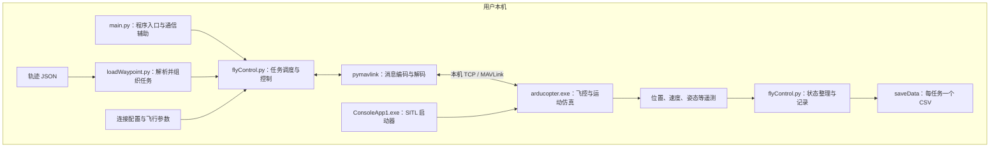

# SimpleGC 框架架构与仿真能力说明

编写日期：2026-09-25  
分析对象：当前工程中的 Python 源码、SITL 配置、使用说明、测试代码和默认轨迹数据。

本文描述当前代码已经具备的功能，并区分配置所表达的能力、尚未实现的扩展方向及实际运行验证情况。本次完成了静态分析和不连接仿真器的数据加载检查，没有启动 SITL 验证完整飞行过程，也没有安装或修改 Python 依赖。

## 1. 框架定位

SimpleGC 是一个基于 **ArduCopter SITL、MAVLink 和 Python 的航点任务执行与飞行状态采集工具**。

它接收已有无人机轨迹，将轨迹位置转换为飞控航点任务，交给本机的 ArduCopter SITL 执行，再采集位置、速度、姿态等遥测数据并输出 CSV。Python 层负责任务组织与数据采集，飞控和运动仿真由 SITL 程序承担。

当前工程最适合用于：

- 验证一条规划路线能否由模拟飞控执行。
- 为给定路线生成包含飞行响应的位置、速度和姿态序列。
- 批量执行不同 agent 的航线，为后续离线分析提供数据。

**当前主程序采用单机连接、任务串行执行方式，尚未实现多机同步协同仿真。** 输入文件中的多个 agent 目前对应多个待执行任务，并不对应同时受控的多个飞行实例。

## 2. 总体架构

### 2.1 仿真执行层

`ArducopterSITL/arducopter.exe` 是工程附带的编译后程序。按照工程使用说明，先运行 `ConsoleApp1.exe` 启动仿真，再启动 Python 控制程序。

SITL 即软件在环仿真：在计算机上运行飞控，并由仿真模型提供运动与传感器响应。ArduPilot 官方提供内置飞控与动力学仿真，也支持连接其他仿真后端。当前工程没有提供启动器或 SITL 的完整源码，因此不能仅凭 Python 文件确认附带二进制的精确版本、编译选项和全部模型特性。[ArduPilot 官方仿真说明](https://ardupilot.org/dev/docs/simulation-2.html)

### 2.2 通信层

Python 使用 `pymavlink` 与 SITL 交换 MAVLink 消息，包括心跳、任务上传请求、任务进度、位置和姿态等。MAVLink 是通信协议，`pymavlink` 是本项目调用的 Python 实现。[MAVLink 官方说明](https://mavlink.io/en/)

当前默认连接地址为 `tcp://127.0.0.1:11010`，代码会将其规范化为 `tcp:127.0.0.1:11010`。

`127.0.0.1` 是本机回环地址，因此当前配置下，Python 与 SITL 都在用户电脑上运行，仿真计算使用本机 CPU 和内存。可见代码中没有云端仿真任务提交逻辑。

### 2.3 任务与数据层

任务层负责读取轨迹、生成航点、上传任务、解锁和切换飞行模式。数据层负责接收遥测、转换单位、计算四元数及地速，并在任务完成后写出 CSV。

这些功能目前集中在几个脚本中，尚未拆分成独立的场景管理、控制算法、评估和可视化子系统。

## 3. 主要文件与职责

| 文件或目录 | 当前职责 |
|---|---|
| `main.py` | 默认入口；提供连接地址处理、MAVLink 连接和遥测辅助函数，入口最终调用 `flyControl.main()` |
| `loadWaypoint.py` | 读取轨迹 JSON，按 agent 拆分任务，按时间排序航点，补充默认高度 |
| `flyControl.py` | 构建任务、上传航点、启动飞行、监控任务进度、记录状态和保存 CSV |
| `saveStatus.py` | 当前为空文件，没有承担记录逻辑 |
| `ArducopterSITL/ConsoleApp1.exe` | 根据使用说明负责启动 SITL；工程未提供其源码 |
| `ArducopterSITL/arducopter.exe` | 编译好的 ArduCopter SITL 程序 |
| `ArducopterSITL/*.dll` | Cygwin、C++ 等配套运行库 |
| `ArducopterSITL/drone.config` | 实例数量、初始位置等启动配置 |
| `ArducopterSITL/TCP -local.port` | MAVLink TCP 连接地址列表 |
| `ArducopterSITL/copter.parm` | 飞控与仿真参数文件 |
| `ArducopterSITL/swarm/` | 各实例的参数、持久化状态、地形及日志等文件 |
| `loadData/` | 输入轨迹数据 |
| `saveData/` | CSV 输出位置；现有 `data_example.json` 是格式示例，包含占位字符串 |
| `tests/` | 使用 Python 内置 `unittest` 的测试，覆盖部分解析、转换及任务交互逻辑 |

`main.py` 还包含单独的遥测显示函数及其参数解析，但直接运行 `python main.py` 进入的是任务执行流程。因此，不应将遥测辅助入口中的 `--index`、`--once` 等参数误认为默认任务入口支持的选项。

## 4. 一次仿真的执行流程

1. **启动 SITL。** 按工程使用说明运行启动器，使虚拟飞控提供 TCP 连接。
2. **装载任务。** 读取默认或指定的 JSON，按 agent 名称排序生成任务列表。
3. **建立连接。** 主程序只读取连接配置中的第一个地址，等待心跳并请求 10 Hz 数据流。
4. **执行初步就绪检查。** 代码检查心跳及可获得的 GPS 状态；这不等于完整的飞控健康检查。
5. **构建任务。** 每条任务包含一个代码中标记为 `home` 的首项、一个起飞项，以及输入轨迹中的有效经纬度航点。
6. **上传任务。** 清除旧任务，发送任务数量，响应飞控的逐项请求，再等待上传 ACK。
7. **启动飞行。** 切换 GUIDED、发送解锁命令，设置任务起始项，切换 AUTO 并发送任务启动命令。
8. **采集状态。** 接收位置、姿态、心跳和任务进度，按约 10 Hz 的目标频率记录。
9. **判断完成并保存。** 根据最后航点到达或任务序号推进信息判断结束，将内存中的记录写入同名 CSV。
10. **执行下一条任务。** 复用同一个飞控连接，继续下一 agent 的路线。

代码中的 `home` 首项并不意味着仿真器被重置或无人机被移动到该经纬度。任务之间也没有明确的降落、返回初始位置或重新初始化步骤。

## 5. 输入与输出

### 5.1 输入格式

加载器按以下优先级识别输入：

| 顶层字段 | 数据组织方式 | 主要使用内容 |
|---|---|---|
| `trajectories` | 每个 agent 包含 `frames` 列表 | 帧时间 `t` 和 `pos.lat/lng/alt` |
| `uavs_coords_raw` | 每个 agent 包含坐标数组 | `lats`、`lngs`、`ts`、可选 `alts` 和 `extras` |
| `uavs_coords_str` | 作为坐标集合传入同一解析函数 | 按与原始坐标相同的数组结构处理；没有额外字符串数值转换逻辑 |

如果同一文件存在多个受支持字段，只采用优先命中的分支。当前默认文件会采用 `uavs_coords_raw`。

缺失的高度默认为 20 m。航点上传使用相对高度坐标框架，因此提供外部高度数据时，需要先确认其高度基准；不能直接将海拔高度当成相对高度使用。

时间 `t` 仅用于航点排序。即使加载阶段保留了速度、加速度、姿态、等待或队形等附加信息，当前任务构建也只将经纬度和高度用于飞行指令。

### 5.2 输出字段

每个完成任务输出一个 `saveData/<agent_id>.csv`，包含以下 15 列：

| 字段 | 含义 | 单位或约定 |
|---|---|---|
| `t` | 从本任务记录开始计算的经过时间 | 秒，来自本机单调时钟 |
| `pos.lat`、`pos.lng` | 经纬度 | 度 |
| `pos.alt` | 飞控报告的相对高度 | m |
| `vel.vx`、`vel.vy`、`vel.vz` | 遥测中的三轴速度 | m/s；代码仅换算单位，没有变换坐标轴 |
| `vel.ground_speed` | 水平地速 | m/s，由前两项速度计算 |
| `orientation.quat.x/y/z/w` | 姿态四元数四个分量 | 由 ATTITUDE 中的欧拉角转换 |
| `angular_vel.p/q/r` | 遥测报告的三轴角速度 | rad/s |

地速按 \(v_g = \sqrt{v_x^2 + v_y^2}\) 计算。

输出不包含加速度、UTM 坐标、队形标签、伙伴列表、设施信息或防御圈事件。接入后续算法时，应核对 MAVLink 消息的坐标系及姿态约定，不应仅根据样例 JSON 中的文字标签解释输出。

代码中虽保留 `build_record_document()`，但当前实际保存路径调用的是 CSV 写入函数，并未输出完整轨迹 JSON。

## 6. 已实现的仿真能力

| 能力 | 当前支持程度 | 可实现的效果与边界 |
|---|---|---|
| 单机自动起飞 | 已有控制流程 | 发送解锁、模式切换和起飞任务，实际成功仍取决于飞控状态 |
| 航点路线飞行 | 已实现 | 沿给定经纬度航点顺序飞行，可组织直线、多段折线及曲线路径的离散近似 |
| 高度变化路线 | 数据与任务指令支持 | 不同航点可指定不同相对高度；当前默认数据没有提供高度变化 |
| 飞行响应数据生成 | 已实现采集接口 | 采集路线执行过程中产生的位置、速度、姿态与角速度，而非直接复制输入轨迹 |
| 多路线批处理 | 已实现串行调度 | 同一虚拟飞行器依次执行不同 agent 的路线，并分别保存文件 |
| 在线运行监视 | 已实现终端显示 | 查看当前任务、任务项序号、记录帧数、模式、解锁状态、高度和位置 |
| 多实例启动配置 | 有配置基础 | 启动配置按文档含义对应多个实例；Python 尚未实现对应的多连接调度 |
| 扰动参数配置 | 存在参数入口 | 参数文件有风和部分传感器扰动项；没有自动扰动实验流程，实际生效需要运行核实 |

可基于输出数据进一步开展轨迹绘制、速度变化分析、姿态变化分析和航线跟踪误差评估。这些属于输出数据支持的后续工作，工程当前没有自动实现绘图、误差计算和报告生成。

## 7. 默认数据实际对应的仿真场景

默认文件为 `loadData/uav_trajectories_persistent_20260213_164652.json`。读取当前 `uavs_coords_raw` 数据得到：

- 24 个 agent，名称分为 `agent_1_*` 至 `agent_4_*` 四组，每组 6 个。
- 共 1949 个轨迹点，每个 agent 有 81 或 82 个点。
- 原始坐标没有 `alts` 数据，因此全部使用默认 20 m 相对高度。
- 添加每任务两个前置项后，共生成 1997 个任务项。
- 附加信息包含 `arc`、`circular`、`horizontal`、`vertical`、`vshape`、`unknown` 等队形标签。
- 文件还包含设施坐标和防御圈定义，但当前控制流程没有使用它们。

`drone.config` 中设置 `X:5`、`Y:1`，按附带说明表示配置 5 个实例；连接文件列出 6 个地址。这些配置数量需要在真正启用多机前统一。**无论文件列出多少地址，当前 Python 主程序都只连接第一个地址。**

默认执行效果是：第一架虚拟无人机执行 `agent_1_0` 的航点路线，结束后保存其 CSV，再执行后续任务。它不会同时呈现 24 架无人机组成队形的过程。

## 8. 当前尚不具备的能力

### 8.1 严格按原时间重放轨迹

任务没有设置逐点到达时间、输入速度目标或等待时长。原始数据中两个点相隔 1 秒，并不表示仿真飞行器将在 1 秒内完成该段飞行。重复坐标与 `is_waiting` 标签也不会自动转化为等时等待指令。

因此，本框架当前执行的是航点路径，不能保证重现原始时空轨迹。

### 8.2 集群协同与交互

当前没有多机同步起飞、统一时钟、队形保持、队形切换、邻机通信、避碰或协同决策控制。队形标签只是输入数据的一部分，没有对应的在线控制算法。

### 8.3 场景感知与对抗建模

当前没有实现雷达探测、目标识别、威胁评估、意图推断、设施交互、防御圈事件或对抗规则。已有设施和防御圈数据不会自动产生这些效果。

### 8.4 图形与视觉传感器仿真

工程没有内置地图轨迹展示、三维场景渲染、相机图像生成或激光雷达点云生成模块。用户直接看到的是终端进度与输出文件。若需要地图或三维演示，需要另行集成可视化工具。

### 8.5 独立可重复的实验管理

串行任务共用同一个飞控实例，未在每次任务前重置位置和状态；也没有实验随机种子、批量参数扫描和自动指标汇总。不同任务的 CSV 不能直接视为相同初始条件下的独立实验结果。

## 9. 数据质量与运行限制

- **记录频率为目标值。** 代码请求 10 Hz 遥测，并约每 0.1 秒读取最近消息；这不保证位置与姿态严格同步，也不保证每条记录都是新遥测。
- **遥测不等同于独立真值。** 输出来自飞控消息，没有单独采集动力学模型真值并进行校验。
- **时间是任务内相对时间。** 每次记录重新计时，没有跨任务、跨飞行器共享的统一时间轴。
- **部分帧可能缺字段。** 仅收到位置或仅收到姿态时，代码也可能形成记录，缺少的 CSV 字段留空。
- **任务完成不等于降落。** 当前任务没有附加明确的返航、降落或解除解锁指令，结束后的行为需结合飞控实际状态确认。
- **记录循环缺少总体超时。** 失去通信或始终未收到完成信息时，可能持续等待或使用缓存数据继续记录。
- **上传确认检查不完整。** 代码检查是否收到 `MISSION_ACK`，但没有检查其结果是否为接受；重传请求的处理也不构成完整的可靠传输状态机。
- **保存发生在任务结束后。** 记录先保存在内存中，中途异常退出可能导致本次任务数据丢失；重复运行同一 agent 会覆盖同名 CSV。
- **默认参数偏理想化。** 参数文件中的风速、湍流及多项传感器噪声设置为零；实际运行参数还需读取飞控确认，不能只根据参数文件断定已生效。

这些限制会影响长时间批处理、不同任务之间的公平比较，以及面向集群算法的数据一致性。

## 10. 运行环境与小体积原因

当前配置下，框架在本机运行，不依赖远程服务器提供仿真计算。工程目录包含编译后的 SITL 与配套 DLL，而 Python、第三方包及系统运行环境位于工程目录之外。

本次统计时，目录文件大小合计约 62.21 MiB，其中教学视频约 34.23 MiB，历史飞行日志约 15.43 MiB；EXE 与 DLL 合计约 8.84 MiB，`arducopter.exe` 本身约 4.24 MiB。上述大小随日志和输出文件增加而变化。

体积较小的主要原因是使用编译后的数值仿真程序、没有大型图形资源，且没有把完整 Python 环境和开发工具链打包进目录。多实例可以复用同一份程序文件，但运行时 CPU、内存和日志占用仍会随实例数增加。

### 10.1 本机 llm 环境检查结果

检查时间为本文编写日期；后续环境变化可能使下表失效。

| 项目 | 结果 |
|---|---|
| Python | `llm` 环境中的 Python 3.12.3，64 位 |
| `pymavlink` | 未安装，实际导入报 `ModuleNotFoundError` |
| `fastcrc` | 未安装；当前上游 `pymavlink` 声明的依赖 |
| `lxml` | 已安装 6.1.1，`lxml.etree` 实际导入正常 |
| 项目所需标准库 | 导入检查通过 |
| 不连接仿真器的任务准备 | 成功读取 24 个任务并生成 1997 个任务项 |

`pymavlink` 的上游依赖声明包括 `lxml` 和 `fastcrc`。[依赖声明](https://github.com/ArduPilot/pymavlink/blob/master/setup.py)

代码错误提示中的 `whqgc` 是写死的安装示例，程序不要求 Conda 环境必须使用该名称。补齐依赖后可以继续使用 `llm`。本次未安装依赖，也未验证 SITL 启动器的系统运行条件；其配置声明使用 .NET Framework 4.6.1。

## 11. 在无人机集群态势感知项目中的用途

当前可将 SimpleGC 放在“规划轨迹 → 飞控执行仿真 → 状态数据采集 → 离线算法分析”的数据生成环节，用于获取带有模拟飞控响应的轨迹数据。

如果目标是验证多机队形、群体交互或在线态势感知，后续扩展宜依次解决：

1. 多机连接管理，以及 agent 与 SITL 实例的一一映射。
2. 统一初始状态、同步启动和统一采样时间轴。
3. 按需求增加速度目标、到达时间或等待控制。
4. 保留输入标签与输出时间的对应关系，建立可用的评估标注。
5. 加入断连、超时、任务失败处理和增量数据保存。
6. 按实验目标集成协同控制、态势感知算法、可视化和评估指标。

以上为扩展方向，不属于当前已经实现的功能。

## 12. 代码核对入口

- [main.py：通信与程序入口](<F:/CASIA/Drone Swarm Situational Awareness Algorithm/Simulation/SimpleGC/main.py>)
- [loadWaypoint.py：输入解析](<F:/CASIA/Drone Swarm Situational Awareness Algorithm/Simulation/SimpleGC/loadWaypoint.py>)
- [flyControl.py：任务控制与记录](<F:/CASIA/Drone Swarm Situational Awareness Algorithm/Simulation/SimpleGC/flyControl.py>)
- [drone.config：实例启动配置](<F:/CASIA/Drone Swarm Situational Awareness Algorithm/Simulation/SimpleGC/ArducopterSITL/drone.config>)
- [copter.parm：飞控与仿真参数](<F:/CASIA/Drone Swarm Situational Awareness Algorithm/Simulation/SimpleGC/ArducopterSITL/copter.parm>)
- [使用说明.md：现有启动说明](<F:/CASIA/Drone Swarm Situational Awareness Algorithm/Simulation/SimpleGC/使用说明.md>)
